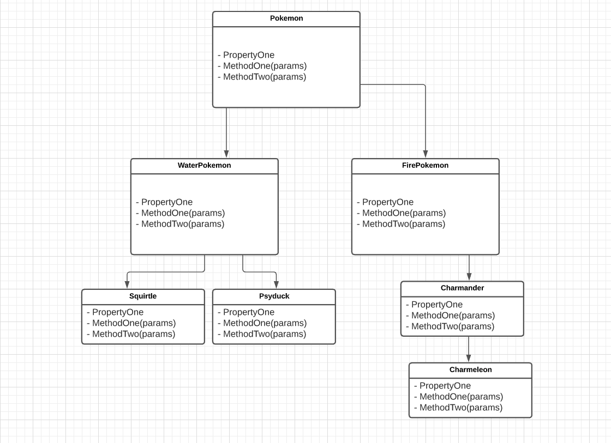
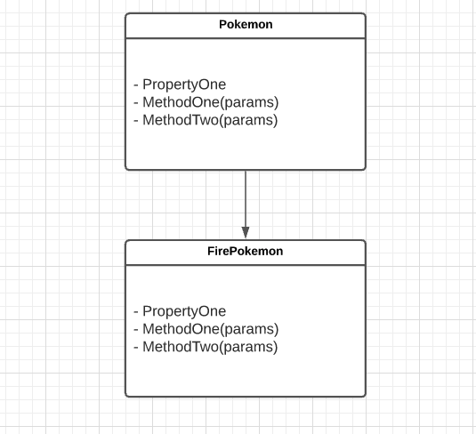

# Chapter 20: Inheritance

## Inheritance in OOP
* `Inheritance` is another pillar of object-oriented programming
  * In total there are four:
    * Encapsulation
    * Polymorphism
    * Abstraction
* `Inheritance` is the ability of one object to acquire some or all properties and or methods of another object
  * It is a similar concept to how we as human inherit traits from our parents
    * Except with OOP inheritance we have more control over what one object can inherit from another
* `Inheritance` is sometimes referred to as subtyping

## Inheritance in C#
* As stated above `inheritance` allows us to let one class acquire some or all properties and or methods from another class
* Lets say we want to create a program that allows you to collect Pokemon
  * When we think about how we want to structure our data we can find some commonalities between objects that we might want to pass along
* With this thought in mind we decide to have two classes Pokemon and FirePokemon
  * The `Pokemon class` is what we would call a `superclass`, `base class`, and or `parent class`
    * The reason for this is because it is the first class that we want to define (more on why in just a bit)
  * The `FirePokemon` class is what we would call a `subclass`, `derived class` and or `child class`
* The syntax for `inheritance` in C# is ver simple to use:
```csharp
public class Pokemon
{
    // All the codes
}

public class FirePokemon : Pokemon
{
    // All the codes
}
```
* In the above code we have:
  1. Create a `base class` called `Pokemon`
  2. Then we have created a `child class` called `FirePokemon` which has extended the `Pokemon` class
     * We are able to extend the Pokemon class to the FirePokemon class with the `:` syntax
* If the code above was completed you would see that we are able to pass properties and methods from the `Pokemon` class to the `FirePokemon` class; more on this in a bit
* In C# a class may only extend one class
* But classes may extend one another in a chain like relationship:

* In this image we can see that we have quite a few classes with a lot of lines, but lets break it down:
  1. We have am overarching `parent` class called Pokemon
  2. Then we have two `subclasses`, both of which extend the Pokemon class:
     1. WaterPokemon
     2. FirePokemon
  3. Each `subclass` has its own `children` that it extends to:
     1. WaterPokemon:
        1. Squirtle
        2. Psyduck
     2. FirePokemon:
        1. Charmander
  4. But then there is a further extension from the Charmander class:
     1. Charmeleon
* What this UML model (more on UML in a bit) is showing is how the Parent class Pokemon can be extended from one child to another and in turn its `methods` and `properties` can be shared to and utilized by `subclasses`

## base Keyword
* Before we jump to deep into code I want you to know what the `base` keyword does
  * In short the `base` keyword allows you to access the extended classes' constructor so that you can provide it information
    * ie: If we extend the Pokemon class to a FirePokemon class when we create an instance of the FirePokemon class we must provide it information for itself and its parent

```csharp
//Pokemon.cs
    // This is just the constructor method:
public Pokemon(int number, string name, double healthPoints)
{
    this.Level = 1;
    this.Number = number;
    this.Name = name;
    this.HealthPoints = healthPoints;
 }

```csharp
//FirePokemon.cs
using System;
namespace Classes
{
    public class FirePokemon : Pokemon
    {
        public string[] ArrayOfAttacks { get; set; }

        public FirePokemon(int number, string name, double healthPoints, string[] attacks)
            : base(number, name, healthPoints)
        {
            this.ArrayOfAttacks = attacks;
        }
        //... Other methods go here...
    }
}
```
* The base method above is what lets us pass data from `FirePokemon`'s constructor to `Pokemon`'s constructor
* Lets see this in action:
```csharp
// Program.cs
string[] attacks = { "scratch", "ember" };

FirePokemon firePokemon1 = new FirePokemon(4, "Charmander", 250, attacks);

firePokemon1.GetPokemonInfo();
firePokemon1.UesAttack1();
firePokemon1.UesAttack2();

Console.WriteLine(firePokemon1.Number);
Console.WriteLine(firePokemon1.Name);
Console.WriteLine(firePokemon1.HealthPoints);
Console.WriteLine(firePokemon1.Level);
Console.WriteLine(firePokemon1.Species);
```

## Inheriting Fields, Properties, and Methods
* So lets take a look at some code

```csharp
// Pokemon.cs
using System;
namespace Classes
{
    public class Pokemon
    {
        public int Number { get; set; }
        public string Name { get; set; }
        public double HealthPoints { get; set; }
        public double Level { get; set; }
        public string Species { get; } = "Pokemon";


        public Pokemon()
        { }

        public Pokemon(int number, string name, double healthPoints)
        {
            this.Level = 1;
            this.Number = number;
            this.Name = name;
            this.HealthPoints = healthPoints;
         }

        public void GetPokemonInfo()
        {
            Console.WriteLine($"Pokemon #{this.Number} | Name: {this.Name} |  HealthPoints: {this.HealthPoints} | Level: {this.Level}");
        }

        public double LevelUp()
        {
            this.Level += 1;
            this.HealthPoints += 100;

            return this.Level;
        }

    }
}
```
```csharp
// Program.cs
using System;

namespace Classes
{
    class Program
    {
        static void Main(string[] args)
        {
            Pokemon pokemon1 = new Pokemon(1, "Bulbasaur", 250);

            pokemon1.GetPokemonInfo();
            pokemon1.LevelUp();
            pokemon1.GetPokemonInfo();
        }
    }
}
```
* In the code above (Pokemon.cs) we have created a class called `Pokemon` it is very similar to classes we have created before
* We also have the Program.cs file where we are creating an instance of the Pokemon class and storing it in a variable called `pokemon1`
* Really quickly lets refer back to a reduced version of our UML Diagram


* With this diagram in mind lets say we want to create a FirePokemon class that extends the Pokemon class:
```csharp
// FirePokemon.cs
using System;
namespace Classes
{
    public class FirePokemon : Pokemon
    {
        public string[] ArrayOfAttacks { get; set; }

        public FirePokemon(int number, string name, double healthPoints, string[] attacks)
            : base(number, name, healthPoints)
        {
            this.ArrayOfAttacks = attacks;
        }

        public void UesAttack1()
        {
            Console.WriteLine($"{this.Name} used {this.ArrayOfAttacks[0]}");
        }

        public void UesAttack2()
        {
            Console.WriteLine($"{this.Name} used {this.ArrayOfAttacks[1]}");
        }
    }
}
```
* Let's Take a look at how we can utilize the properties and methods that are inherited by the FirePokemon class from the Pokemon class:

```csharp
// program.cs

using System;

namespace Classes
{
    class Program
    {
        static void Main(string[] args)
        {
            Pokemon pokemon1 = new Pokemon(1, "Bulbasaur", 250);

            pokemon1.GetPokemonInfo();
            pokemon1.LevelUp();
            pokemon1.GetPokemonInfo();

            string[] attacks = { "scratch", "ember" };

            FirePokemon firePokemon1 = new FirePokemon(4, "Charmander", 250, attacks);

            firePokemon1.GetPokemonInfo();

            firePokemon1.UesAttack1();
            firePokemon1.UesAttack2();

            firePokemon1.LevelUp()
            firePokemon1.GetPokemonInfo();

        }
    }
}
```
* First things first when we create an instance of the FirePokemon class sense we have utilized the `base` keyword we must provide the constructor with the needed information for the `FirePokemon` class and the `Pokemon` class which it extends
* Once we do that we are now able to utilize the methods from the Pokemon class within an Instance of the FirePokemon class
* You can also access the properties that are inherited:

```csharp
using System;

namespace Classes
{
    class Program
    {
        static void Main(string[] args)
        {
            string[] attacks = { "scratch", "ember" };

            FirePokemon firePokemon1 = new FirePokemon(4, "Charmander", 250, attacks);

            firePokemon1.GetPokemonInfo();
            firePokemon1.UesAttack1();
            firePokemon1.UesAttack2();

            Console.WriteLine(firePokemon1.Number);
            Console.WriteLine(firePokemon1.Name);
            Console.WriteLine(firePokemon1.HealthPoints);
            Console.WriteLine(firePokemon1.Level);
            Console.WriteLine(firePokemon1.Species);

        }
    }
}
```
## override
* The override keyword allows us to override a methods that have been passed down by a parent class to the child class
* This is the exact same concept as when we looked at overriding the `ToString()` method in a earlier lesson
* Let's say we want to override the `Pokemon` class' `LevelUp` method within the `FirePokemon` class:
  1. The first thing we need to do is update the `Pokemon` class' `LevelUp()` method by adding the `virtual`
     * In short the `virtual` keyword allows us to specify when we want a classes method to be modifiable by a child class
```csharp
// Pokemon.cs
public virtual double LevelUp()
{
   this.Level += 1;
   this.HealthPoints += 100;

   return this.Level;
}
```

  2. Next we can override the `LevelUp()` method within the `FirePokemon` class
     * In order to do this we just have to declare a `LevelUp()` method within the `FirePokemon` class and be sure to utilize the `override` keyword with in the methods signature
```csharp
public override double LevelUp()
{
   this.Level += 1;
   this.HealthPoints += 250;
   Console.WriteLine($"{this.Name} has leveled up by {this.Level} levels and there new health point count is {this.HealthPoints}");
   return this.Level;
}
```

* Now lets see this in action:

```csharp
// Program.cs
using System;

namespace Classes
{
    class Program
    {
        static void Main(string[] args)
        {
            Pokemon pokemon1 = new Pokemon(1, "Bulbasaur", 250);

            pokemon1.GetPokemonInfo();
            pokemon1.LevelUp();
            pokemon1.GetPokemonInfo();
            
            Console.WriteLine("<------->");

            string[] attacks = { "scratch", "ember" };

            FirePokemon firePokemon1 = new FirePokemon(4, "Charmander", 250, attacks);

            firePokemon1.GetPokemonInfo();
            firePokemon1.LevelUp();
            firePokemon1.GetPokemonInfo();

        }
    }
}

```
## Object Class


