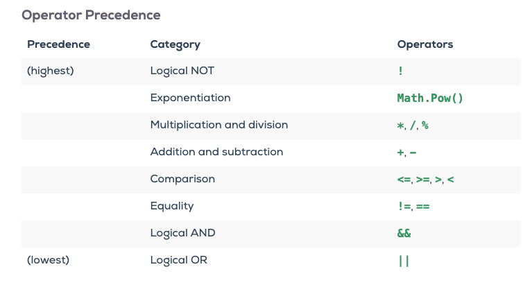
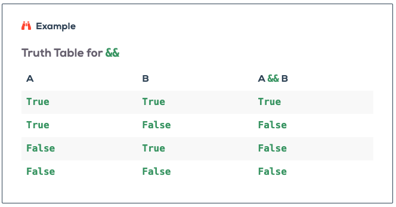
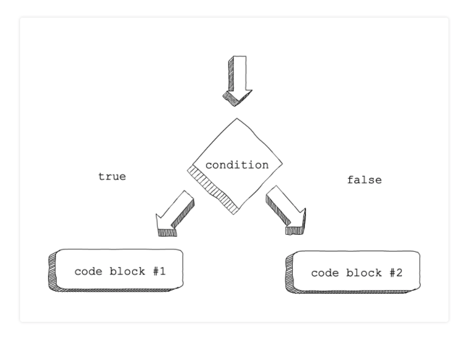

# Chapter 5: Making Decisions With Conditionals
## Booleans
* An important core feature of any programming language is the ability to handle conditional logic
  * Conditional logic allows you to empower your code with the capability to reason based on pre-defined logic
  * ie:
    * If this is true then do this
    * If this is not true do this instead
### Booleans Values
* The `boolean` data type is meant for storing two values:
  1. `true`
  2. `false`
     * In C# boolean values are `case-sensitive`
       * These **are** valid: `true` or `false`
       * These **are not** valid: `True` or `False`
* The `true` and `false` values **are not** `strings`
```C#
Console.WriteLine(true);
// Outputs: True

Console.WriteLine(true.GetType());
// Outputs: System.Boolean

Console.WriteLine(false.GetType());
// Outputs: System.Boolean
```
### Boolean Conversion
* The `boolean` type also has a conversion function:
  * `Convert.ToBoolean()`
    * It is similar to the `Int32.Parse()` and `Double.Parse()` methods
      * This is super limited and is rarely used
        * Use-case would be if you are accepting user input that explicitly expects the words `true` or `false`
* `Try it!` section results:
```C#
Console.WriteLine(Convert.ToBoolean("true"));
// Outputs: True

Console.WriteLine(Convert.ToBoolean("TRUE"));
// Outputs: True

Console.WriteLine(Convert.ToBoolean(0));
// Outputs: False

Console.WriteLine(Convert.ToBoolean(1));
// Outputs: True

Console.WriteLine(Convert.ToBoolean(-1));
// Outputs: True

Console.WriteLine(Convert.ToBoolean(""));
// Outputs: System.FormatException: String was not recognized as a valid Boolean.
Console.WriteLine(Convert.ToBoolean("LaunchCode"));
// Outputs: System.FormatException: String was not recognized as a valid Boolean.
```
* **Gotchas**:
  * `Int32`: When converting true if value is not zero; otherwise, false
  * `String`: true if value equals [TrueString](https://docs.microsoft.com/en-us/dotnet/api/system.boolean.truestring?view=net-5.0), or false if value equals [FalseString](https://docs.microsoft.com/en-us/dotnet/api/system.boolean.falsestring?view=net-5.0) or null.
    * `TrueString`: Represents the Boolean value true as a string. This field is read-only.
      * Meaning the `string` must be any spelling variation of the string `"true"`
    * `FalseString`: Represents the Boolean value false as a string. This field is read-only.
      * Meaning the `string` must be any spelling variation of the string `"false"`
  * More on how this method works with other data types can be found [here](https://docs.microsoft.com/en-us/dotnet/api/system.convert.toboolean?view=net-5.0#System_Convert_ToBoolean_System_String_)
### Booleans Expressions
* A `boolean expression` is an expression that evaluates to either `True` or `False`
* The `equality operator` `==` is able to compare two values and returns a `true` or `false`

```C#
Console.WriteLine(5 == 5);
// Outputs: True
Console.WriteLine(5 == 6);
// Outputs: False
```
#### Comparison Operators
* The `==` is one of six common `comparison operators`:


* **Gotchas**:
  * A _common error_ is to use a  `=` instead of `==`.
    * `=`: is an assignment operator
      * `string name = yoda`
    * `==` is a comparison operator
      * `5 == 5` 
  * `=<` and `=>` are not recognized operators.
    * **Use These**: `>=` and `<=`
    * **Don't Use**: `=<` and `=>`
  * An equality test is symmetric, meaning that we can swap the places of the operands and the result is the same:
```C#
string a = 7

a == 7
// Outputs: True

7 == a
// Outputs: True 
```

  * Whereas, an assignment statement is not symmetric:
```C#
string a = 7
// This is legal


7 = a
// This is not legal
```
## Logical Operators
* Remember that an `operator` is one or more characters that performs an action on it `operand(s)`
  * ie: `5 * 5`
    * `Operator`: `*`
    * `Operands`: `5` and `5`
  * So far we have seen three types of `operators`:
    * Arithmetic operators: `+`, `-`, `*`, `/`, and `%`
      * Take `number` `operands`
      * Return a `number`
    * The string operator: `+`
      * Take `string` `operands`
      * Return a `string`
    * Compound assignment operators: `+=` and `-=`
      * Take `numbers` or `strings`
      * Reassigning the value of the first, variable operand.
### Boolean Operators
* Comparison Operators (`==`, `<`, etc.) are apart of the`boolean operators` class due to the fact that they return a `boolean value`
#### Logical AND
* `Compound boolean expression`: a boolean expression built out of smaller boolean expressions.
  * `AND operator (&&)`: allows us to perform compound
  * This `operator` takes two `operands` and will only evaluate:
    * `True`: if both operands are `True` **individually**
    * `False`: if either operand are `False`

```C#
Console.WriteLine(7 > 5 && 5 > 3);
// Outputs: True
    // Both 7 > 5  and 5 > 3 are True
        // So the expression evaluates True

Console.WriteLine(7 > 5 && 2 > 3);
// Outputs: False
    // Whereas 7 > 5 is True
    // 2 > 3 is False
        // So the expression evaluates False

Console.WriteLine(2 > 3 && 'dog' == 'cat');
// Outputs: False
    // 2 > 3 is False
    // 'dog' == 'cat' is False
        // So the expression evaluates False
```
#### Logical OR
* The `OR Operator (||)` also creates compound boolean expressions
  * This `operator` also takes two `operands` will evaluate:
    * `True`: if either operand are `True`
    * `False`: if both operands are `False`

```C#
Console.WriteLine(7 > 5 || 5 > 3);
// Outputs: True
    // Both 7 > 5  and 5 > 3 are True
        // So the expression evaluates True

Console.WriteLine(7 > 5 || 2 > 3);
// Outputs: True
    // 7 > 5 is True
    // 2 > 3 is False
        // Since 7 > 5 operand evaluates True the expression evaluates True

Console.WriteLine(2 > 3 || 'dog' == 'cat');
// Outputs: False
    // 2 > 3 is False
    // 'dog' == 'cat' is False
        // So the expression evaluates False
```

* **Gotchas**:
  * The `&` and `|` are both **valid** `bitwise operators`
    * `Bitwise operators`: operators are used to perform bit level operations on integer (int, long, etc) and boolean data.
    * These operators are not commonly used in real life situations and _fall outside the scope of this class_.
      * Want to know more?! Resources:
        * [C# Bitwise and Bit Shift Operators](https://www.programiz.com/csharp-programming/bitwise-operators)
        * [Practical Applications of Bitwise Operations](https://stackoverflow.com/questions/3883384/practical-applications-of-bitwise-operations)
    * The long and short of it is **DO NOT USE THESE!!**... unless you know what you are doing with them
      * "At the end of the day.. You are an Engineer, Do whatever you want!"
#### Logical NOT
* The `NOT operator (!)` takes a single operand and reverses its `boolean` value

```C#
Console.WriteLine(!true);
// Output: False

Console.WriteLine(!false);
// Output: True
```
* **Fun Facts**:
  * The `!` operator is also called the "bang" operator
  * Roger has a `!` operator tattoo

* Another set of examples
```C#
Console.WriteLine( !(5 > 7) );
// Output: True

Console.WriteLine( !("Obi Wan" > "Yoda") );
// Output: True
```
### Operator Precedence
* `Operator precedence`: the set of rules that dictate the order the operators are applied



* Whereas you could write an `expression` like this:
```C#
x * 5 >= 10 && y - 6 <= 20
```

* It is recommended to use parentheses:
```C#
((x * 5) >= 10) && ((y - 6) <= 20)
```
* The `expression` would evaluate as follows:
  1. Perform the arithmetic
  2. Then check the relationships
  3. Then && evaluation will be done last
* Even though we used `parentheses` they do not a difference
  *  It just makes your code easier to read
### Truth Tables
* `Truth tables` help us understand how logical operators work by calculating all of the possible return values of a boolean expression.



* The above `&& truth table` assumes we have two boolean expressions, A and B that are joined by &&.
  * What we are able to check here is the following line by line (top to bottom):
    * if `A = true` &&  `B = true`
      * Then our expression is `True`
    * if `A = true` &&  `B = false`
      * Then our expression is `False`
    * if `A = false` &&  `B = true`
      * Then our expression is `False`
    * if `A = false` &&  `B = false`
      * Then our expression is `False`
## Conditionals
* Now that we understand `boolean` logic we can tie it together to start working with `conditional` statements
### if Statements
* `if statement`: the most basic form of a conditional
```C#
if (condition) // if the condition is true
{
    // do something
} // if it is false do nothing
```
* We can check if an expression evaluates `false`
```C#
bool isPicardTheBest = false;

if (isPicardTheBest == false)
{
   Console.WriteLine("You Dam skippy! Sisko is the best!!");
}

// Outputs: You Dam skippy! Sisko is the best!!
```
* We can also perform multiple actions within a conditional's `code block`:
```C#
int num = 6;
if (num % 2 == 0 && num > 3)
{
   Console.WriteLine(num + " is even");
   Console.WriteLine(num + " is greater than 3");
}

// Outputs: 6 is even
// Outputs: 6 is greater than 3
```

* **Gotchas**:
  * Common conventions:
    * For readability code within a conditional code block is typically indented
    * Opening `{` are placed below the first line
    * Closing `}` are placed on a line of its own following the last line of the code block
  * Whereas these are just conventions should be followed, they should be followed
    * Don't be this person:
```C#
bool isPicardTheBest = false;

if (isPicardTheBest == false)
{Console.WriteLine("You Dam skippy! Sisko is the best!!");
Console.WriteLine("Why are you being this person?!");
Console.WriteLine("Oh I get it your a rebel!");
Console.WriteLine("Very...");
Console.WriteLine("Funny....");
Console.WriteLine("I am cracking up!");
Console.WriteLine("¯\_(ツ)_/¯");}

// Outputs: I'm not typing all that out... again... Do it yourself...
```
  * You are able to omit your `{}` if the code block only has one line
    * You can also ride a bike with no handlebars...
    * I do not recommend either option...
      * But hey, you are a "Engineer"... Do what you want!
      * I'm just kidding.. Don't do it!
### else Clauses
* `Else clause`: can be paired with an `if statement`
  * It specifics code that should be be triggered if the `previous` condition evaluates as false.
```C#
if("This is True")
{
    // Do This
}
else
{
    // Do This
}
```
* This structure is known as a `else-if statement`
  * It provides a mechanism for `branching`
  * `Branching` is when you program has the ability to flow down different paths based on the conditional evaluations
    * ie:
```C#
bool isPicardTheBest = true;

if (isPicardTheBest == false)
{
   Console.WriteLine("You Dam skippy! Sisko is the best!!");
}
else
{
   Console.WriteLine("Where as I think Picard is Amazing! I disagree, Sisko is the best!!");
}

// Outputs: Where as I think Picard is Amazing! I disagree, Sisko is the best!!
```
* Here's an image representation:

### else if Statements
* Whereas `if-else statements` allow our program to `branch` via two alternative, what do we do when we need multiple branches?
  * `else if clause`: allow us to add more complex conditional logic to our program
```C#
if("This is True")
{
    // Do This
}
else if ("This is False")
{
    // Do This
}
else
{
    // Do This
}
```
* Let's see this in action:
```C#
bool isPicardTheBest = true;

if (isPicardTheBest == false)
{
   Console.WriteLine("You Dam skippy! Sisko is the best!!");
}
else if (isPicardTheBest == true)
{
   Console.WriteLine("Where as I think Picard is Amazing! I disagree, Sisko is the best!!");
}
else
{
   Console.WriteLine("I mean I guess you are entitled to your own opinion");
}
```
* **Gotchas**:
  * With `if`, `else if`, and `else` our programs branching capabilities are endless
  * The only things to keep in mind are:
    1. We may not use `else` or `else if` without a _preceding_ `if statement`
    2. `else` and `else if` clauses are _optional_.
    3. Multiple `else if` statements may follow the `if statement`
       * But they must _precede_ the `else clause`, if one is present.
    4. _Only one_ `else clause` may be used.
## Nested Conditionals
* `Nested conditions`: allow us to write more complex branching logic to our programs

```C#
int num = 6;

if (num % 2 == 0)
{
    Console.WriteLine("EVEN");

    if (num > 0)
    {
        Console.WriteLine("POSITIVE");
    }
}

// Outputs: EVEN
// Outputs: POSITIVE
```
* Above we are able to test number
  * If (the number is even) -> Console.WriteLine("EVEN")
    * If ( the number is positive) -> Console.WriteLine("POSITIVE")

* **Gotchas**:
  * When we put one conditional inside another, the body of the nested conditional is indented by two tabs rather than one.
    * This convention helps in readability
  * Nested `if statements` can also contain an `else statement`.
    * With nested statements, the `else clause` belongs to the last unpaired `if`.
      * Remember you can only use an else when you have an if.
  * `else` and `else if` rules apply the same way within nested conditionals as in unnested ones.

```C#
int num = 7;

if(num < 9)
{
   if (num % 2 == 0)
   {
      Console.WriteLine("EVEN");
   }

   else
   {
      Console.WriteLine("ODD");
   }
}

// Outputs: ODD
```