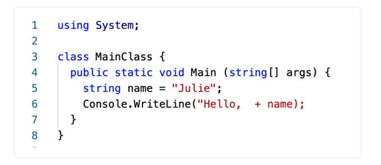

# Chapter 6: Errors and Debugging
- [Chapter 6: Errors and Debugging](#chapter-6-errors-and-debugging)
  - [What is Debugging](#what-is-debugging)
    - [Beginning Tips For Debugging](#beginning-tips-for-debugging)
  - [Categories of Errors](#categories-of-errors)
    - [Stages of C# Execution](#stages-of-c-execution)
      - [Compilation](#compilation)
      - [Execution](#execution)
    - [Compile-Time Errors, Warnings, and Exceptions](#compile-time-errors-warnings-and-exceptions)
      - [Compiler Errors](#compiler-errors)
      - [Compiler Warnings](#compiler-warnings)
      - [Exceptions](#exceptions)
    - [Logic Errors](#logic-errors)
  - [Diagnosing Error Messages](#diagnosing-error-messages)
    - [Complier Messages 101](#complier-messages-101)
    - [Syntax Highlighting](#syntax-highlighting)
  - [Debugging Logic Errors](#debugging-logic-errors)
    - [Printing Values](#printing-values)
  - [Errors and User Input](#errors-and-user-input)
    - [TryParse](#tryparse)
      - [TryParse and out](#tryparse-and-out)
  - [How to Avoid Debugging](#how-to-avoid-debugging)
    - [Start Small](#start-small)
    - [Keep It Working](#keep-it-working)
  - [Asking Good Questions](#asking-good-questions)
    - [What is the problem with your code?](#what-is-the-problem-with-your-code)
    - [What have you done to try to address the problem?](#what-have-you-done-to-try-to-address-the-problem)
    - [Where have you looked for an answer?](#where-have-you-looked-for-an-answer)
  - [Whats Next](#whats-next)
## What is Debugging
* `Bugs`: are programming errors that prevents a program from working as intended
* `Debugging`: is the process of tracking down `bugs` and correcting them
* There are three types of errors:
  1. `Syntax Errors`
  2. `Runtime Errors`
  3. `Logic Errors`
### Beginning Tips For Debugging
1. Debugging require a detective like mindset
2. 9 times out 10 its an issue with your code not `C#`
3. Think critically about what you have written in your code
   * Ask yourself:
     * What am I trying to do here?
     * What have I told my code to do?
## Categories of Errors
* Be sure to categorize your errors before trying to debug them
* Each bug type manifests itself in a different way
* Once you know the type of bug you can come up with a strategy to squash it
### Stages of C# Execution
* Remember there are two stages of code execution:
  1. Compilation
  2. Execution
#### Compilation
* `Compilation Stage`: is the process of your code being `complied`, `validated`, and `prepared` for `execution` before it is ran
  * Think of it as a `pre-flight` check
* In a nut shell the `compilation stage` verifies the syntax and structure of the code
  * There is a lot that happens during this stage, but for now we will just stick with the understanding that we have defined above

#### Execution
* `Execution Stage`: is when our code logic is actually carried out
  * ie: printing to the console, prompting the user for input, making calculations, etc.
  * Think of it as the plane taking flight

### Compile-Time Errors, Warnings, and Exceptions
* C# will only execute a program if the programs syntax is correct
* `Syntax` is the structure of the language and the rules that govern it
* C#'s `complier` is super dope!
  * When in action it reads each line of your code and performs all coding task
* If the `complier` detects an `bug` in your code it will stop and give you feedback
* Said feedback falls into one of the following:
  1. `Compile Errors`
  2. `Compile Warnings`
  3. `Exceptions`

#### Compiler Errors
* `Compile Errors`: usually a violation of the syntax rules of the language
  * ie: `Syntax Errors`
* `Syntax Errors` are triggered during the `compilation stage`
  * If there is a single `syntax error` C# will quit the program and throw an error
  * Due to this we normally receive `syntax error` before any others
* Example of syntax errors:
```C#
string city = Philly;
Console.WriteLine(city;

// Outputs: error CS1525: Unexpected symbol `;', expecting `)' or `,'
// Outputs: Compilation failed: 1 error(s), 0 warnings
```

#### Compiler Warnings
* `Warning`: are thrown when your code is functional but there is a flaw in the logic or execution of it
  * These `warnings` are normally for things like a variable that has been declared but was never used
```C#
string animal = "Sloth";
string jedi;
Console.WriteLine(animal);
// Outputs: warning CS0168: The variable `jedi' is declared but never used
// Outputs: Compilation succeeded - 1 warning(s)
// Outputs: Sloth
```
* Notice here we are provided a `warning` but out code is still executed
#### Exceptions
* `Exceptions`: occur while the program is running
  * Usually caused by an unanticipated error in your code
* Have you seen an `Unhandled Exception` error message yet?
  * They can be caused by things like:
    * Unanticipated user input
    * Trying to divide by zero
    * etc.
* Talking about `exceptions` is a large topic, one that could take an entire lecture period
  * We will cover more in future lectures
  * If you want to read more checkout:
    * [C# - Exception Handling](https://www.tutorialspoint.com/csharp/csharp_exception_handling.htm)
    * [Exceptions and Exception Handling](https://docs.microsoft.com/en-us/dotnet/csharp/fundamentals/exceptions/)

```C#
Console.WriteLine(5/0);
// Outputs: main.cs(6,23): error CS0020: Division by constant zero
// Outputs: Compilation failed: 1 error(s), 0 warnings
```
### Logic Errors
* `Logic Error`: as stated is an error with your `logic` of the code you have written
  * `Logic Errors` at times can be hard to diagnose due to the fact that your code will successfully `compile` and `execute` but it will not function as intended
    * ie: What you wanted the program to do is not what you told it to do
```C#
double weeklyPay = 600;

double dailyEarnings = weeklyPay / 7;
Console.WriteLine(dailyEarnings);

// Outputs: 85.71428571428571
```
* Let's say you wanted to see how much you make in a 5 day work week
* You work 5 days a week
* And are expecting to make $100/day
* Yet according to the code above you make $85.71/day
* _What is the issue?_
  * Well you are dividing by _7 days_ instead of _5 days_
## Diagnosing Error Messages
* **Error Messages are your friend**
### Complier Messages 101
* Let's step through some errors:
  * For this example it will help to run the code in this [repl.it](https://replit.com/@rc1336/compiler-messages-101)
```C#
using System;

class MainClass {
   public static void Main (string[] args) {

      string name = "Julie";
      Console.WriteLine("Hello,  + name);
   }
}

// Outputs: main.cs(7,39): error CS1010: Newline in constant
// Outputs: main.cs(8,2): error CS1525: Unexpected symbol `}', expecting `)' or `,'
// Outputs: main.cs(8,3): error CS1002: ; expected
// Outputs: Compilation failed: 3 error(s), 0 warnings
// Outputs: compiler exit status 1
```
* How to approach squashing these bugs:
  1. The **first** error is always where you want to start
     * The rest of your error normal spawn from that point
  2. Breakdown the error: `main.cs(7,39): error CS1010: Newline in constant`
     1. `main.cs`: is the `namespace` where the error was thrown
        * We have not covered `namespace`, for now just think of it as the file where this error was thrown
     2. `(7, 39)`:
        1. `7`: is referring to _Line 7_ in out IDE
        2. `39`: is referring to the character in which the error was thrown
           * In this case that would be the `;` at the end of the line
     3. `error CS1010: Newline in constant`: is the actual error message
        1. `CS1010`: is the error code
        2. `Newline in constant`: this informing you that a `string was not properly delimited`
  3. If at this point you are still unsure if the issue `C#` actually has a [list](https://docs.microsoft.com/en-us/dotnet/csharp/language-reference/compiler-messages/) of `error codes` you can refer to
* At this point you might be able to see that the error is a missing `"` to close the string `"Hello`
  * To fix this issue you would have to do this:
```C#
using System;

class MainClass {
   public static void Main (string[] args) {

      string name = "Julie";
      Console.WriteLine("Hello,"  + name);
   }
}
```
* The major takeaway here is that C# attempts to provide you with as much information as possible to assist you in squashing your bug.
  * You just have to know how to decipher what it is trying to tell you
### Syntax Highlighting
* `Syntax highlighting`: marks different types of tokens (words in your code) in different ways


* In the image above the following colors denote:
  * `Red`: strings
  * `Blue`: data types
* With the above in mind:
  * The `string` _Hello_ is colored red
  * Most of the symbols `=, ;, ., and ()` are colored black.
  * Yet at the end of Line 2 the final `)` and `;` are both red rather than black.
  * Since we haven’t closed the string, the editor assumes that these two symbols are part of the string.
  * Since we expect `);` to be black in this editor, the difference in color is a clue that something is wrong with our syntax.
## Debugging Logic Errors
* Unlike `runtime` and `syntax` errors, `logic errors` do not provide `error messages`
  * Due to this its not as easy to provide a step-by-step algorithm to solve them.
* There are _two strategies_ that can be helpful though:
  * `Debugger tools`
  * `Writing test`

### Printing Values
* The first thing you should do if your code does not produce the expected result is **check the values** of the `variable` being used
* Say you have the following console program requirements:
  * It should prompt the user for a `number` that represents a `Temperature in Celsius`
  * It should store the users input in a variable
  * It should then convert and print the the `number` provided into Kelvin

```C#
Console.WriteLine("Temp in degrees C:");
string degreesC = Console.ReadLine();
Console.WriteLine("Degrees K: " + degreesC + 273.15);
```

* How do we figure out the `logic error`?
  * First I would print my `variable(s)` to the `console` to make sure I am getting the data I am expecting:
```C#
Console.WriteLine("Temp in degrees C:");
string degreesC = Console.ReadLine();

Console.WriteLine(degreesC);

Console.WriteLine("Degrees K: " + degreesC + 273.15);

// Outputs: 25
// Outputs: Degrees K: 25273.15
```
* That doesn't really help me out
* So the next thing I would try is checking the `data type` of my variable
```C#
Console.WriteLine("Temp in degrees C:");
string degreesC = Console.ReadLine();

Console.WriteLine(degreesC.GetType());

Console.WriteLine("Degrees K: " + degreesC + 273.15);

// Outputs: System.String
// Outputs: Degrees K: 25273.15
```
* Ah Ha! Now I can tell that `degreeC` is actually a `string` not a number!
  * And in turn I now know that when I perform the operation `degreesC + 273.15` that:
    1. The `+` sign is being utilize by `C#` as a `String operator` not a `arithmetic operator`
    2. So rather than me `adding` `degreeC + 273.15`
    3. I am _concatenating_ them together as a `string`
* With all this in mind I am able to fix my program by performing the following:
```C#
Console.WriteLine("Temp in degrees C:");
string degreesC = Console.ReadLine();
double degreesCDouble = Double.Parse(degreesC);
Console.WriteLine("Degrees K: " + degreesCDouble + 273.15);

// Output: Degrees K: 25273.15
```
* Wait What?!
  * Ohh I see...
  * I am still concatenating on line 4...
  * Let's try this:
```C#
Console.WriteLine("Temp in degrees C:");
string degreesC = Console.ReadLine();
double degreesCDouble = Double.Parse(degreesC);
double degreesK = degreesCDouble + 273.15;
Console.WriteLine("Degrees K: " + degreesK);
```
* The **main takeaway** here is that `logic errors` are normally not `C#`'s fault.
* If your code is compiling with out errors but does not output the data you are expecting its probably a good idea to take a step back and digging deeper into what _you told your code to do_ not _what you expect it to do_

## Errors and User Input
* So whereas in out last step we were able to fix our `logic errors` so that the correct number is returned within our string
  * There is something we did not account for... User Input
* What if our user was to provide us `one thousand` instead of `1000`?
  * What would our program output?
  * Let's take a look:
```C#
Console.WriteLine("Temp in degrees C:");
string degreesC = Console.ReadLine();
  // Say a user provides: "One Thousand" instead of 1000

double degreesCDouble = Double.Parse(degreesC);
double degreesK = degreesCDouble + 273.15;
Console.WriteLine("Degrees K: " + degreesK);

// Outputs: Unhandled Exception:
  // System.FormatException: Input string was not in a correct format.
```
* Well that is not what we want the user to see
* So how do we fix this?
  * Entering from darkside `TryParse`
### TryParse
* `TryParse`: uses booleans and conditionals to verify if the correct `data type` was provided

#### TryParse and out
* `out` is a keyword that can be used by `TryParse`
* In our example below `out` is attempting to reassigning our `string` value `(degreesC)` a `numeric` value and store it in `degreesCDouble`

```C#
Console.WriteLine("Temp in degrees C:");
string degreesC = Console.ReadLine();
double degreesCDouble;

if (Double.TryParse(degreesC, out degreesCDouble))
{
   double degreesK = degreesCDouble + 273.15;
   Console.WriteLine("Degrees K: " + degreesK);
}
else
{
   Console.WriteLine("Please enter a numeric value.");
}
```
* Let's break this down:
  * Line 1, we print the prompt asking the user to provide a temperature reading.
  * Line 2, `degreesC` is initialized once the user puts in their value.
  * Line 3, `degreesCDouble` is declared, but not initialized.
  * Line 5, we take `degreesC` and attempt to parse it into a double.
* If this is `true`, then our program will:
  * First, since the input is a valid double, `TryParse` will assign the parsed value to `degreesCDouble` via the `out` keyword, thereby initializing it.
  * Second, the `degreesCDouble` variable is initialized.
  * Third, `degreesCDouble` is used in **Line 7** to initialize `degreesK`.
  * Finally, **Line 8** prints our results.
* If **Line 5** is **false**, then `TryParse` is not able to assign any values. When this happens the else clause is triggered, and **Line 12** prints.

* **Main Takeaways:**
  * Whereas this may seem like a lot of code we are now beginning to learn how to take into account `edge cases` and how to start thinking about methods of validation based on them
    * `Edge cases`: typically involves input values that require special handling in an algorithm behind a computer program
  * Even though we are using `TryParse` with a `double` in our example it _can be used_ with all `primitive data types`

## How to Avoid Debugging
* I mean you can try to avoid it but at the end of the day it is going to happen
  * And in turn (in my opinion) debugging makes you a much stronger Engineer
  * Every error you solve is more knowledge you've gained
* But if you really want a few ideas on how to _potentially_ avoid debugging:
### Start Small
* As the title say _Start Small_!
* As much as pop culture would like you to believe the best programmers do not sit in some dark dank room and write 1000s of lines of code in one sitting
  * Well some might sit in a room like that
* But the main thing here is that experienced programmers know that the best way to write any program is to take it one small step at a time
  * Plan out what it is you want to build, one you know how you want the program to be architected
  * Build it is small bite size pieces
  * This will allow you to foresee potential errors before they arise
### Keep It Working
* Once you have a small piece working **RUN YOU CODE!**
* The worse thing you can ever do is code for more than 30-45 mins and not run your code
  * By doing so you introduce the possibility of have multiple `errors` in your code
    * Whether that be `logic`, `compile`, and or `execution` errors
* A motto I was taught when I first started learning was:
  1. `Make it work`: When you start off building something just get smalls pieces of the code functional in as few or many steps as are needed
  2. `Make it pretty`: Then once you have that piece working you can loo at making the code more concise and or D.R.Y.
  4. `Make it fast`: Once the code is D.R.Y and concise then you can worry about optimizations to make the code run faster or perform more efficiently
## Asking Good Questions
* Asking a good question is an art form
* But there are things you can keep in mind to help you become a skilled question asker:
### What is the problem with your code?
* Clearly define the problem you are having and provide context as to what you are expecting the code to do code:
    * `Context:` I am building a console application which accepts user input via `Console.ReadLine` for two numbers and then adds them together
    * `The Issue`: When I print the operation to the console it seems to be combining the two number `22 + 22 = 2222` instead of `22 + 22 = 44`
### What have you done to try to address the problem?
* Provide information on what you have done in attempting to remedy the issue:
  * I have attempted to print my two variables to the console and see that they are storing the right values but am still unable to understand why they are not being added together correctly
### Where have you looked for an answer?
* Provide any resources you may have looked at to assist you in remedying the issue:
  * I have looked at this `StackOverFlow` article and see that people state the following: `xyz...`. But still do not fully under `xyz...`

* **Main Takeaways**:
  * Asking for help is a vital part of being a programmer and something you will continuously learn how to get better at
  * The main thing I would like you to takeaway is that the best way to ask a question is to provide as much details as possible
    * By doing this you are able to reanalyze what it is you are trying to do
    * A lot of the time when you are in the process of explaining your issue to someone you will have a `AH HA` moment and realize the issue without them having to tell you anything

## Whats Next
1. First, student will need to complete (In this order):
   1. [Exercises: Debugging](https://education.launchcode.org/intro-to-programming-csharp/chapters/errors-and-debugging/exercises.html)
   2. There is no studio for this chapter
2. Then students should read [7. Stringing Characters Together](https://education.launchcode.org/intro-to-programming-csharp/chapters/strings/index.html)
3. Then students will sit for [Chapter 7's Lecture](./chapter-7-stringing-characters-together.md)