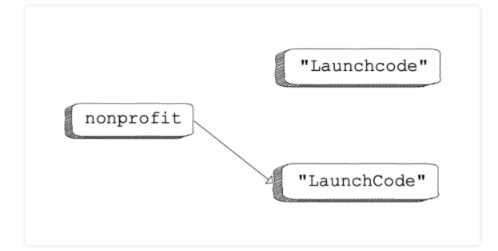
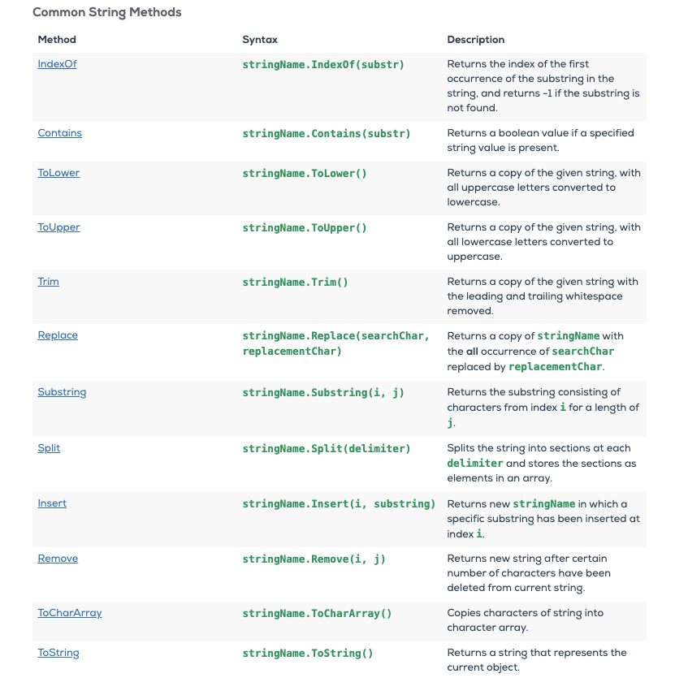

# Chapter 7: Stringing Characters Together
## Strings as Collections
* Up to this point we have look at `strings` from a very limited perspective
* `String` are like onions.. They have layers:
  * They have a special group of operation called `methods`
  * They are also considered a `collection data type`
### Collection Data Types
* `Collection Data Types`: data types that are made up of smaller pieces
  * They are also referred to as `collection types`
  * `Character`: or better known as `char` is a data type that contains one element:
    * ie: 'f' or '/' or '0'
    * We encase `char`s on single quotes `' '`
* `Strings` can be thought of collections of `chars`
```C#
using System;

class MainClass {
  public static void Main (string[] args) {
    char letterOne = 'c'; // non-collection data-type
    char letterTwo = 'a'; // non-collection data-type
    char letterThree = 't'; // non-collection data-type

    string word = "cat"; // collection data-type

    // Under the hood a string is made up of multiple chars
  }
}
```

* **Gotchas**:
  * Data types like `number` and `boolean` are not `collection data types`
    * ie: they are not made up of smaller characters

### Ordered Collections
* `Strings` are defined as `sequential collections` of characters
  * Meaning that each character should be ordered from left to right
    * ie: "Ordered Collection" != "Collection Ordered" even though they contain the exact same characters
* `Ordered Collections`: are any collection type with elements that are ordered


## Bracket Notation
* `Bracket notation`: allows us to access the an individual `index` within a string
  * An `index` is the numeric location of an item's position with in a `sequence`
    * A `sequence` can be many things in our current context it is a `string`
      * We will talk more about what other  `sequences` we can access via an `index` at a later date
  * Its also important to know that in the programming world we utilize what is called `Zero-based numbering`
    * `zero-based numbering`: is a fancy way of saying we start counting at 0 instead of 1
* Let's say we want to access the first letter within a string:
```C#
      string name = "Teal'c";
      Console.WriteLine(name[0]);
      // Outputs: T
```
* We access it by utilize `bracket notation` and provided the first index which is `0`
  * This is a bit trippy at first but the long and short of it is:
    * 0 = The first index
    * 1 = The second index
    * 2 = The third index
```C#
      string name = "Teal'c";
      Console.WriteLine(name[0]);
      Console.WriteLine(name[1]);
      Console.WriteLine(name[2]);
      // Outputs: T
      // Outputs: e
      // Outputs: a
```

* Once we wrap our heads around that we can start to do some really cool things with `strings`:
```C#
    string firstThroughTheGate = "Ernest Littlefield";
    char firstInitial = firstThroughTheGate[0];
    char lastInitial = firstThroughTheGate[7];

    string outputStr = "The initials of the person through the Star Gate in modern history was " +
      firstInitial + "." +
      lastInitial + ".";

    Console.WriteLine(outputStr);
```
* **Gotchas**:
  * Be careful not to try and access an index that doesn't exist:
```C#
    string csDesigner = "Anders Hejlsberg";

    Console.WriteLine(csDesigner[-1]);
    Console.WriteLine(csDesigner[42]);
    // Outputs: Unhandled Exception:
        // System.IndexOutOfRangeException: Index was outside the bounds of the array.
```
## Strings as Objects
* **Disclaimers**:
  * At our current place within the curriculum the topic of `objects` is being introduced to give you insight and a high level understanding that will assist you later in the course
  * A `class` is a blueprint in which an `object` can be created from
    * ie: A `class` is the blueprint and an `object` is the building built from the blueprint
* We have yet to review classes but they will be covered in more detail in _chapter 12_
* In this section we are talking about `strings` as an `object` because when you create a string you are creating an `instance` of the `String class`
  * With this in mind an `Object` consist of three things:
    1. `State`: represents `attributes` (or property) of an `object`
       * `attributes` can be thought of as `variables` within an `object`
    2. `Behavior`: represent `methods` of an `object`
    3. `Identity`: gives the `object` a unique name or identifier
       * A unique identifier is needed because you can have multiple instances of an object based on a `class`
* You can find an example of a class [here](https://replit.com/@rc1336/Class-Demo)

### Object Terminology
#### Dot Notation
* Within the context of a `Object`:
  * `Methods` can be thought of as `functions`
  * `Properties` can be thought of as `variables`
* `Dot notation` is used to access `methods` and `properties` within an `object`
    * Say we have a object called `Dog` every dog has `breed` and the ability to `bark`
      * `breed` would be a `property`
      * `bark` would be a `method`
    * If you wanted to access the `Dog` objects `breed` property you would write: `Dog.breed`
    * If you wanted to access the `Dog` objects `bark` method you would write: `Dog.bark()`
* Again this is a super high level example and just meant to give context
  * We will return to this subject in _chapter 12_
### String Are Objects
* Every `string` we create has the same `properties` and `method` that we can use to either:
  1. `Property`: get specific data about it
     * `Length` is a helpful `string property`
     * `Length` returns the total amount of `char`s in a `string`
  2. `Methods`: perform an action on it with
     * `ToLower()` is a helpful `string method`
     * `ToLower()` convert every `char` in a `string` to lowercase
```C#
    string city = "MIAMI";

    Console.WriteLine(city.Length);
    // Outputs: 5

    Console.WriteLine(city.ToLower());
    // Outputs: miami
```
## String Immutability
* When an `object` cannot be changed we say it is `immutable`
  * `Strings` are `immutable` meaning we can not change individual `char`s within a string
```C#
    string animal = "dog";

    Console.WriteLine(animal);
    animal[0] = 'D';
    Console.WriteLine(animal);
    // Output: main.cs(8,11): error CS0200: Property or indexer `string.this[int]' cannot be assigned to (it is read-only)
```
* **Gotchas**:
  * Knowing that `strings` are `immutable` it is important to clarify that when we change the value of a `variable` that stores a `string` we are not changing the `strings` value
    * We are changing the reference location that the variable is storing:
```C#
string nonprofit = "Launchcode";
nonprofit = "LaunchCode";

Console.WriteLine(nonprofit);
```
  * This image give a clearer picture as to what happens in the code above:
  
  * Another way to think of this is:
    * Let's say in your phone you have a contact for me `Roger`
      * In my contact you can store my `address`
        * For the sake of this example lets consider the term `address` to be our variable
        * Currently I live at `123 Stargate Lane, Upper Marlboro, MD, 20772` so you would set:
          * `string address = "123 Stargate Lane, Upper Marlboro, MD, 20772"`
        * If I were to move to lets say `Salt Lake City, UT` you would need to update my address (the variable) in your phone:
          * `address = "456 Enterprise Way, Salt Lake City, UT, 84044"`
        * With in the context of this example:
          * The `address string variable` has not changed but the reference to where I live has been updated
          * This is what the image above is demonstrating
          * When we change the value of an `string variable` we are:
            1. Actually creating a `new string` in memory
            2. Updated the location where the variable references is pointed to so that it can find the new `string value` within the programs memory
            3. The previously created string is then thrown away

    * Per Microsoft's [Immutability of String Objects](https://docs.microsoft.com/en-us/dotnet/csharp/programming-guide/strings/#immutability-of-string-objects) documentations:
      * _If you create a reference to a string, and then "modify" the original string, the reference will continue to point to the original object instead of the new object that was created when the string was modified._
```C#
    string s1 = "Hello ";
    string s2 = s1;
    s1 += "World";

    Console.WriteLine(s2);
    // Outputs: Hello
```
## String Methods
* There are many `string methods` available within C#
* Remember that `strings` are `immutable` so when you perform a `method` on one it is not changing the original it is just creating and returning a new one

### Common String Methods
* Here is a list of common `string methods`


* You can find more here:
  * [W3Schools](https://www.w3schools.com/cs/cs_strings.php)
  * [Microsoft Docs](https://docs.microsoft.com/en-us/dotnet/api/system.string?view=net-5.0)

## Encoding Characters
* Whereas I feel Encoding Character is a super cool concept I do not feel at this point in your programming careers it is something you need to focus on.
* With that in mind I feel it is great to know that encoding is something you can work with.
* The long and short (mostly long) of this section is just explaining that:
  * As we know computers can only understand `0s` and `1s`
    * Due to this fact some very smart people a long time ago had to come up with ways to translate `0s` and `1` into `numbers`, `letter`, `symbols`, and eventually `emojis` (who doesn't love a good emoji)
      * This was done via a translation method called `character encodings`
    * The most well known and used `character encoding` is `ASCII` (ask-ee)
      * `ASCII` has a [table](https://www.ascii-code.com/) which provides a scheme for every `numbers`, `letter`, and `symbols` you can probably think of
      * `Emojis` are handled by a different versions of the Unicode character
* This section also talks about how to handle `Character Encoding in C#`
  * But I do not feel like it is worth covering at the moment in this course
    * If you find yourself needing this in a project there are plenty of resources out on the net that can assist you
      * And by the time you need those resources you will be more then qualified to understand the wealth of information they offer.
      * You can also refer back section [7.6.3. Character Encodings in C#](https://education.launchcode.org/intro-to-programming-csharp/chapters/strings/encoding-characters.html#character-encodings-in-c)
* If you are interested here are how some of the data measurements work:
    * A `bit` is a unit a measurement that helps of keep track of the size of computer data collections
      * ie: `0` and `1`
    * A `byte` is a set of `8 bits`
      * ie: `00101101` or `11110011`
      * A `bytes` represent a `binary number`
    * A `binary numbers` is a number representation that only uses 0s and 1s
    * `Decimal number` are what we are used to seeing and are built out of integer `0-9`

## Special Characters
* `Special characters`: allow us to include character in strings that would be difficult or impossible to include otherwise
  * They begin with a `\`
  * The most common special characters are:
    * `\n`: newline
    * `\t`: tab
```C#
    Console.WriteLine("A message\nbroken across lines,\n\tand indented");
    // Outputs: A message
            //  broken across lines,
                 // and indented
```

* You can also utilize `Unicode` characters with `\uXXXX` the `Xs` are combination that can be found on the [Unicode table](https://unicode-table.com/en/)
```C#
    Console.WriteLine("The interrobang character, \u203d, combines ? and !");
    Console.WriteLine("The area of a circle is \u03C0r\u00B2");

    // Outputs: The interrobang character, ‽, combines ? and !
    // Outputs: The area of a circle is πr²
```

* `Escaping a character` is when we use the `\` to include quotes within a string
```C#
    Console.WriteLine("\"The dog's favorite toy is a stuffed hedgehog,\" said Chris");
    // Outputs: "The dog's favorite toy is a stuffed hedgehog," said Chris
```

## String Interpolation
* So `string concatenation` sucks!
* There is a more concise way to handle this action:
  * ie: `String Interpolation`
* `String Interpolation` allows us to insert expressions and variables into our `strings`
* You can interpolate a `string` by:
    1. Starting the it with a `$`
    2. Then encasing the entire string in `""` just like normal
    3. But you must enclose any `variables` in `{ }`
```C#
      string breed = "Goldendoodles";
      int amount = 5;

      Console.WriteLine($"I\'ve always wanted {amount} {breed}!");
```

### Composite Format Strings
* In legacy (older) versions of C# (version 5 and lower) `Composite Formatting` was the standard way of performing  `string interpolation` on larger data types like `objects`
  * Since the release of C# 6 you are now able to use the `$ - string interpolation` syntax to handle all `string interpolation`
  * You can read more on this here:
    * [Composite formatting](https://docs.microsoft.com/en-us/dotnet/standard/base-types/composite-formatting)
    * [$ - string interpolation (C# reference)](https://docs.microsoft.com/en-us/dotnet/csharp/language-reference/tokens/interpolated)
* But for reference I wanted to leave this section in so you would at least know how the syntax works
```C#
      string breed = "Goldendoodles";
      int amount = 5;

      Console.WriteLine("I\'ve always wanted {0} {1}!", breed, amount);
```
* How this syntax works is:
  * You provide a `zero-based` index within the actual string
    * ie: `{0}` and `{1}`
  * These indices represent the variables that you are passing as additional arguments to `WriteLine()`
    * ie:
      * `{0}`: breed
      * `{1}`: amount

* Again this is no longer need you are able to use `$ - string interpolation` which is showcased in the [String Interpolation section](#string-interpolation) above

## Whats Next
1. First, student will need to complete (In this order):
   1. [Exercises: Strings](https://education.launchcode.org/intro-to-programming-csharp/chapters/strings/exercises.html)
2. Then students should read [Chapter 8: Arrays Keep Things in Order](provide-link-here)
3. Then students will sit for [Chapter 8's Lecture](./chapter-8-arrays-keep-things-in-order.md)