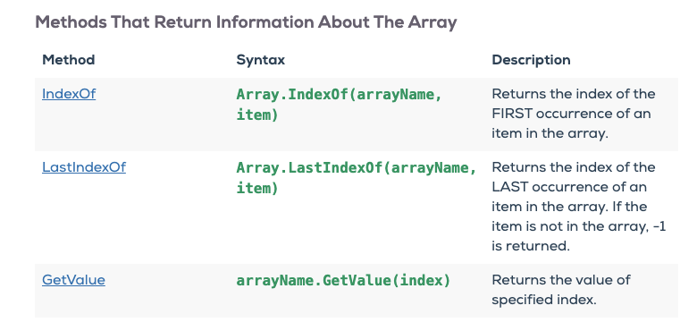
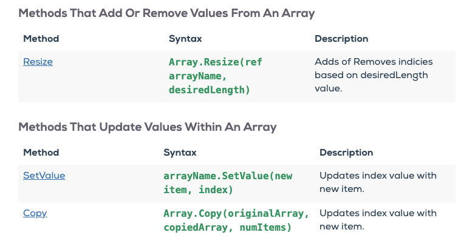
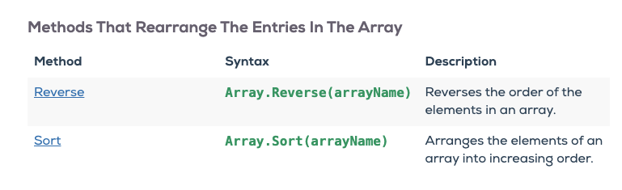
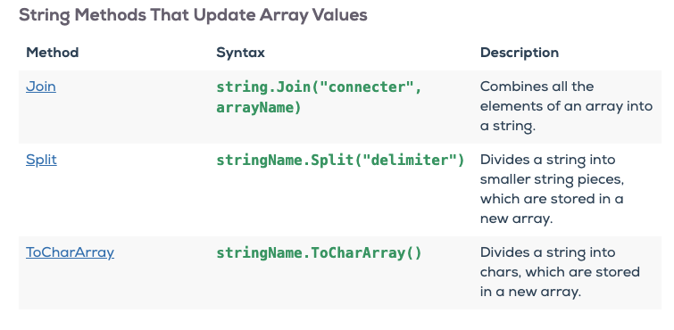
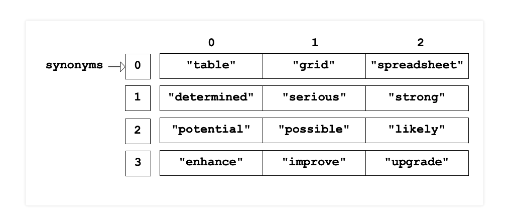

# Chapter 8: Arrays Keep Things in Order
## Arrays Are Like Strings
* `Arrays` are a sequence of values of one data type which can be accessed by an `index`
* Similar to `strings` ones an array is created with value you can not increase or decrease its size
  * Yet you are able to change a specific `indices` value
    * More on all this in a moment
### Declaring An Array
* In C# there are `4` ways to declare an `Array`
```C#
// Create an array of four elements, and add values later
string[] starships = new string[4];

// Create an array of four elements and add values right away
string[] starships = new string[4] {"Galactica", "USS Enterprise", "Millennium Falcon", "Ranger"};

// Create an array of four elements without specifying the size
string[] starships = new string[] {"Galactica", "USS Enterprise", "Millennium Falcon", "Ranger"};

// Create an array of four elements, omitting the new keyword, and without specifying the size
string[] starships = {"Galactica", "USS Enterprise", "Millennium Falcon", "Ranger"};
```
* All are valid
  * I personally like the last option, in my opinion it just look more concise and cleaner
    * But hey you are a engineer. Do whatever you want!

#### The new Operator
* The `new` `keyword` can be utilized in 3 different ways in C# for now we will only be utilizing it as an `operator`
  * When used in this fashion it _allows us to create an object_
  * In the context of this chapter we are creating an `Array object`
* As stated in the earlier section you can create an `Array` 4 different ways:
  * 3 of which utilize the `new` keyword as an `operator`
        1. Create an array of four elements, and add values later
            * `string[] starships = new string[4];`
        2. Create an array of four elements and add values right away
           * `string[] starships = new string[4] {"Galactica", "USS Enterprise", "Millennium Falcon", "Ranger"};`
        3. // Create an array of four elements without specifying the size
           * `string[] starships = new string[] {"Galactica", "USS Enterprise", "Millennium Falcon", "Ranger"};`
* Again my suggested would be to use the last option; but the choice is yours
* **Gotchas**:
  *  If you declare an array and initialize it later, you have to use the new keyword:
  * Don't do this:
```C#
      string[] starships;
      starships = {"Galactica", "USS Enterprise", "Millennium Falcon", "Ranger"};
      // Outputs: error CS1525: Unexpected symbol `{'
```
   * Do this:
```C#

    string[] starships;
    starships = new string[] {"Galactica", "USS Enterprise", "Millennium Falcon", "Ranger"};
```

### Array Length
* Like with `strings` the `Length` property returns the `length` of the array
  * In C# `Array` lengths are `static` meaning they cannot be changed
```C#
    string[] starships = {"Galactica", "USS Enterprise", "Millennium Falcon", "Ranger"};
    Console.WriteLine(starships.Length);
    // Outputs: 4
```

## Working With Arrays
### Bracket Notation and Index
* Again like `strings` `arrays` can be accessed via an `index`
  * You can access an `array` from `0` up to `array.Length-1`
```C#
    string[] starships = {"Galactica", "USS Enterprise", "Millennium Falcon", "Ranger"};

    Console.WriteLine(starships[0]);
    // Outputs: Galactica

    Console.WriteLine(starships[1]);
    // Outputs: USS Enterprise

    Console.WriteLine(starships[2]);
    // Outputs: Millennium Falcon

    Console.WriteLine(starships[3]);
    // Outputs: Ranger

    Console.WriteLine(starships[starships.Length-1]);
    // Outputs: Ranger
```
* Be sure when trying to access an array you do not attempt to access an index that does not exist:
```C#
    string[] starships = {"Galactica", "USS Enterprise", "Millennium Falcon", "Ranger"};

    Console.WriteLine(starships[5]);
    // Outputs: Unhandled Exception:
    // System.IndexOutOfRangeException: Index was outside the bounds of the array.
```

### Arrays are Mutable
* `Arrays` indices are `mutable`
* `Mutability`: is when an object's data can be modified after creation
```C#
    string[] starships = {"Galactica", "USS Enterprise", "Millennium Falcon", "Ranger"};

    Console.WriteLine(starships[3]);
    // Outputs: Ranger

    starships[3] = "Voyager";

    Console.WriteLine(starships[3]);
    // Outputs: Voyager
```
* **Gotchas**:
  * Now whereas you _can_ change a specific index's value you _cannot_ create a new index and add a value to an `array` after creation:
```C#
    string[] starships = {"Galactica", "USS Enterprise", "Millennium Falcon", "Ranger"};

    starships[4] = "Defiant";
    Console.WriteLine(starships[4]);

    // Outputs: Unhandled Exception:
    // System.IndexOutOfRangeException: Index was outside the bounds of the array.
```
  * If this is something you needed to do you would have to create a new `array` and store that within the `variable` as a new reference type:
```C#
    string[] starships = {"Galactica", "USS Enterprise", "Millennium Falcon", "Ranger"};

    Console.WriteLine(starships.Length);
    // Outputs: 4

    starships = new string[] {"Galactica", "USS Enterprise", "Millennium Falcon", "Ranger", "Defiant"};

    Console.WriteLine(starships.Length);
    // Outputs: 5
```

## Array Methods
* There are a few helpful `array methods` in C#
  1. `Sort()`
```C#
    string[] starships = new string[] {"Galactica", "USS Enterprise", "Millennium Falcon", "Ranger", "Defiant"};

    Console.WriteLine(starships[0]);

    Array.Sort(starships);

    Console.WriteLine(starships[0]);
```
  2. `Reverse()`
```C#
    string[] starships = new string[] {"Galactica", "USS Enterprise", "Millennium Falcon", "Ranger", "Defiant"};

    Console.WriteLine(starships[0]);
    Array.Reverse(starships);
    Console.WriteLine(starships[0]);
```
  * Here is a list of some common `array methods`:





## Multidimensional Arrays
* A `multidimensional array` is a bit of a brain buster
  * But have no fear Roger here is!!
* Let's get a couple of theory things out of the way first:
  1. `Multi-dimensional arrays` are considered `rectangular array`
  2. The _inner_ arrays must store the same data as the outer arrays
* Quick visual to help you see what a `multi-dimensional arrays` looks like:


### Two Dimensional Arrays
* So we are only going to focus on `2-dimensional arrays` **but** I do want you to know:
  1. You can declare a `2-dimensional array` of `strings` like this:
     * string [,] names;
  2. You can also declare a `2-dimensional array` or `3-dimensional array` of `ints` like this:
     * 2D: int [ , ];
     * 3D: int [ , , ] m;
       * The `m` means `decimal`
       * I know counter intuitive right?!
* Anywho back to `2D arrays`:
```C#
    int [,] twoDimArray = new int [3,4]
    {
      {0, 1, 2, 3} , // initializers for row indexed by 0
      {4, 5, 6, 7} , // initializers for row indexed by 1
      {8, 9, 10, 11} // initializers for row indexed by 2
    };
```
* So let's breakdown what we have done above:
  1. First, we `declare` a `variable` called `twoDimArray`
     * And precede it with the `array` data type and stated it will stores `int`s
     * `int [,]`
  2. We then start the process of `initializing` its value to a `new` `instance` of an `array` that will store `int`s
     * `new int`
  3. Next we set the `rank` (number of dimensions) for our `2D array`
     * `[3,4]`
       * What we are saying here is we want a `2D array` with:
       * `Outer Array` that has `3` indices
       * `Inner Arrays` that have `4` indices a piece
  4. We then provide values for the inner and outer `arrays`:
```C#
    {
      {0, 1, 2, 3} , // initializers for outer array indexed by 0
      {4, 5, 6, 7} , // initializers for outer array indexed by 1
      {8, 9, 10, 11} // initializers for outer array indexed by 2
    };
```
* Now let's say we want to access the `2D array` and get the value `5`
```C#
    int [,] twoDimArray = new int [3,4]
    {
      {0, 1, 2, 3} , // initializers for outer array indexed by 0
      {4, 5, 6, 7} , // initializers for outer array indexed by 1
      {8, 9, 10, 11} // initializers for outer array indexed by 2
    };

    int val = twoDimArray[2,3];
    Console.WriteLine(val);
```
* Let's break it down:
  1. We create a new variable called `val` which will store an `int`
  2. We set `val`'s value to:
     * `twoDimArray[2]`: which returns `{4, 5, 6, 7}`
     * `twoDimArray[2,3 ]`: which returns `5`

#### A More Concise Way to Make a 2D Array
* So the textbook shows you an example similar to the one above so I wanted to provide a detailed example of how it works
* I personally feel there is a more concise way to go about creating a 2D Array
  * "Remember there is no wrong way to code, other than the way that doesn't work" - Roger Campbell II
* So let's give my approach a try:
```C#
    int[,] conciseTwoDim =
    {
      {0, 1, 2, 3} , // initializers for outer array indexed by 0
      {4, 5, 6, 7} , // initializers for outer array indexed by 1
      {8, 9, 10, 11} // initializers for outer array indexed by 2
    };

    int conciseVal = conciseTwoDim[2,3];
    Console.WriteLine(conciseVal);
```
* With this approach we remove some of the extra and unneeded code
  * But the logic is the exact same
* Let's break it down:
  1. First, we `declare` a `variable` called `conciseTwoDim`
     * And precede it with the `array` data type and stated it will stores `int`s
     * `int [,]`
  2. We then provide values for the inner and outer `arrays`:
```C#
    {
      {0, 1, 2, 3} , // initializers for outer array indexed by 0
      {4, 5, 6, 7} , // initializers for outer array indexed by 1
      {8, 9, 10, 11} // initializers for outer array indexed by 2
    };
```
* With this approach we do not have to worry about:
  1. Start the process of `initializing` its value to a `new` `instance` of an `array` that will store `int`s
  2. And we can forgo setting the `rank`  for our `2D array`

* Multidimensional Arrays is a pretty heavy topic and you can find more information on it in [Microsoft's documentation](https://docs.microsoft.com/en-us/dotnet/csharp/programming-guide/arrays/multidimensional-arrays)
## Whats Next
This section tell the lead instructor, teaching assistants, and students what to expect next.

1. First, student will need to complete (In this order):
   1. [Exercises: <Name Goes Here>](provide-link-here)
   2. [Studio: <Name Goes Here>](provide-link-here)
2. Then students should read [Chapter <# Goes Here>: <Name of Chapter Goes Here>](provide-link-here)
3. Then students will sit for [Chapter <# Goes Here> Lecture](provided-link-here)