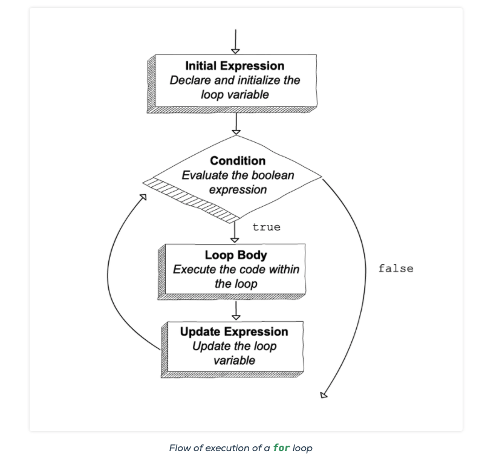
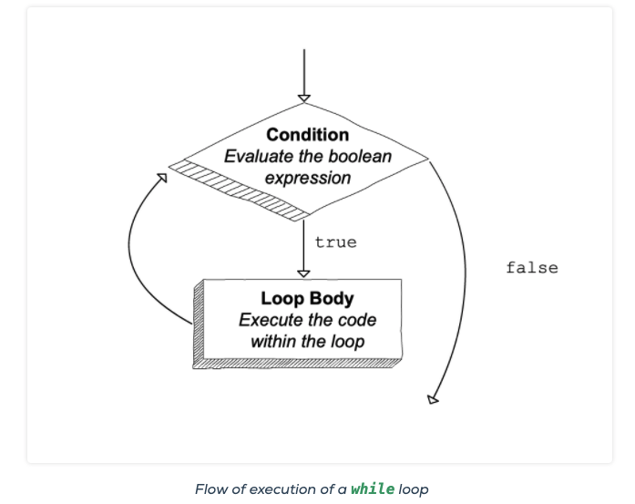

# Repeating With Loops

## Iteration
* `Iteration`: is a sequence of instructions that is continually repeated
* There are `3` different types of iterations:
  1. `Iterate` until a certain condition is reached
  2. `Iterate` a certain number of times
  3. `Iterate` through `elements` (or items) in a `list` or `array`
* Lets say we want to count from `0 to 100` with the tools we currently have we would have to do the following:
```C#
Console.WriteLine(0);
Console.WriteLine(1);
Console.WriteLine(2);
Console.WriteLine(3);
Console.WriteLine(4);
Console.WriteLine(5);
Console.WriteLine(6);
// keep going...
Console.WriteLine(100);
```
* Well I'll tell you one thing that sure as heck isn't D.R.Y.!
* So how could we go about performing this task without having to write so much redundant code?
* Entering from this corner your new best friend... The `for loop`!
  * Let's see them in action!!
```C#
for (int i = 0; i < 100; i++)
{
   Console.WriteLine(i);
   // Try running this to see the output
}
```
* Now that is what I call D.R.Y.

# for Loops
* Whereas there are many types of `loops` a `for loop` is the first one you should know and understand
* `for loops` are typically used for `definite iteration`
* Above we saw the syntax for a `for loop` but lets peel back the layer and see what is going on with this onion:
```C#
for (initializer; condition; iterator)
{
  // code block to be executed
}
```
* First off; we have to realize that 5 things are going on in the above code:
  1. The `for` `keyword` tells C# we want to create a `for loop`
     * A for loop has three statements: `initialization`, `condition` and `iterator`
  2. The `initializer` is the `initial expression` that is executed at the onset of the loop and only once
     * It `declares` and `initializes` a `variable`
     * It is common convention is to use the letter `i`
  3. The `condition` is a boolean expression that either returns `true` or `false`
        * For as long as the expression returns true the loop will continue to run
        * ie: `iterate`
  4. The `code block execution` perform a task every time the `condition`'s expression evaluates as true
  5. The `iterator` either `increment` or `decrements` the initialized variable each time the the `execution block` runs
     * `Increment` mean to increase
     * `Decrements` means to decrease

* Let's see this in action again and step through it:
```C#
for (int i = 0; i < 4; i++)
{
   Console.WriteLine(i);
}
// Outputs: 0
// Outputs: 1
// Outputs: 2
// Outputs: 3
```
* Ok here we go:
  1. `for keyword`: Tells C# that we are starting a for loop
  2. `int i = 0`: we are creating a variable `i` and setting its value to `0`
  3. `i < 4`: is our condition which states `for as long as i's value is less than 4` run our code block
  4. Next the `code block` performs its work: `Console.WriteLine(i);`
     * On our first iteration `i = 0` and `0` is printed to the console
  5. Then our `iterator` increments `i` by one
     * `i++` is the same as saying `i = i + 1`
  6.  Finally our condition runs again and evaluates `i < 4` once more
          * is `i less than 4`?
          * Yes! Which means the loop iterates again and runs back through steps 1-6 again until the condition evaluates false

* Can you figure out what this `for loop` is doing?
```C#
    for (int i = 100; i > 0; i--)
    {
        Console.WriteLine(i);
    }
```
* It is counting down from 100!
  * This is an example of `decrementing`

* Here is a great image that showcases the logic of a `for loop`:



## Iterating Over Collections
* So if you like really?! That's it I can now count faster...
* Slow your roll ducklings lets take this up a notch

### Iterating Over Strings
* Ok ok so we have looked at utilizing a `for loop` for counting now let see how we utilize it for working with `strings`

```C#
    string name = "The Wheel on the bus!";

    for (int index = 0; index < name.Length; index++)
    {
      Console.WriteLine(name[index]);
    }
```
* The `for loop` allows us to `iterate` over the string and print each individual `char` that it contains!
* This is a game changer!!
* Let's add some context here:
  * It you look we changed the variable from `i` to `index`
    * `i` is an abbreviation for `index`
    * What we are able to do with the variable `index` is substitute a `static index` for our dynamic which in turn allows us to `iterate` over each `index` within our `string`
      * ie:
        * Up until now when we wanted to access a `string`'s index we would do this: `Console.WriteLine(name[0]);` which would output `T`
        * But now we can use `i` and access every index!
* Let see what happens if we switch up or logic and `decrement` instead of `increment`

```C#
    string name = "The Wheel on the bus!";
    Console.WriteLine(name.Length-1);

    for (int index = (name.Length - 1); index > 0; index--)
    {
      Console.WriteLine(name[index]);
    }
```
* Here we are able to iterate over the `string` from right to left!

### Iterating Over Arrays
* Ok so with what we just saw with `iterating` over an `string` think about the possibilities for working with `arrays`!
* Let's jump right in!

```C#
    string[] teas = { "black tea", "green tea", "white tea", "oolong tea", "purple tea", "herbal infusions"};

    for (int index = 0; index < teas.Length; index++)
    {
      Console.WriteLine(teas[index]);
    }
```
## Breaking Down the for Statement
### for Loop Anatomy
* The important thing here is to remember that there are three separate statements that work in tandem within a `for loop`:
  1. Initial Expression
  2. Loop Condition
  3. Update Expression (The iterator)
#### Initial Expression
* As stated above the `initial expression` is executed once before the any iterations happen
* You have the freedom to utilize any expression
  * Even an empty one
  * Although that is not a normal scenario,
    * Normally you will declare and initialize a variable
      * But hey _you are an Engineer do what you want!_
* The long and short of it is you can start off with any value you would like:
```C#
    for (int i = 50; i < 100; i++)
    {
      Console.WriteLine(i);
    }
```
* In the above example we set the value of our `initial expression` to `50`
```C#
    string[] jediRanks = { "Youngling", "Padawan", "Jedi Service Corps", "Jedi Knight", "Jedi Consular", "Jedi Guardian"};

    for (int index = 3; index < jediRanks.Length; index++)
    {
      Console.WriteLine(jediRanks[index]);
    }
```
* In this example we are able to set the value of our `initial expression` to 3
* The main take away here is you are able to set this value however you would like

#### Loop Condition
* The `loop condition` is a boolean expression that either returns `true` or `false`
  * It executes before each `loop iteration`
  * It will always be a `boolean expression`
    * ie: will evaluate to:
      * `true`: which means the loops code block executes and the loop `iterates` again
      * `false` means the loop execution stops and there are no more `iterations`
```C#
    string school = "Hogwarts";

    for (int i = -3; i > 1; i++)
    {
      Console.WriteLine(school[i]);
    }
```
* The above `loop's code block` will never run execution due to the `condition` never evaluating as `true`

```C#
    string school = "Hogwarts";

    for (int i = 0; i > -1; i++)
    {
      Console.WriteLine(school);
    }
```
* Make sure you pay attention to your `conditional logic`
* There is a disasterist phenomena
  * Yea, yea I know that might not be a word but you try running that code and see what happens...
  * I dare you...
  * Go ahead...
  * You're an Engineer.. Do whatever you want!

#### Update Expression
* The `iterator` or also known as the `update expression`:
  * Executes after _every_ `iteration` of a loop
  * This expression can be technically be anything
    * But there are rare instances where you might use it for anything other than updating the value of the `initial expression`
* The main thing to take away is that we use the `iterator` to increment or decrement the `initial expressions` value
```C#
    for (int i = 0; i < 51; i = i + 2)
    {
      Console.WriteLine(i);
    }
```

## The Accumulator Pattern
* A `pattern` is a general repeatable solution to a commonly occurring problem in software design
* In following section we will look at a few different patterns for solving various type of logic problems

### Adding 1..n
* We are going write a program that adds up the integers 1…n, where n is an integer variable that we will create.
* One common programming “pattern” is to traverse a sequence, accumulating a value as we go:
* Let's take a look at how we would do this with a `for loop`
```C#
int n = 6;
int total = 0;

for (int i = 1; i <= n; i++)
{
   total += i;
}

Console.WriteLine(total);
// Outputs: 21
```
* The major part of this code example is to start to display that you with `loops` you are able to start handling more sophisticated logic or patterns within your code

### Reversing a String
* Another common pattern you will be asked to solve is or might need to utilize within your own programs is reversing a string
  * In some other languages there are methods that will allow you to reverse a string in C# there is no method for the string class that will explicitly do this
    * Side note: you could potentially convert the string to a different data type say an array and then utilize its `Reverse` method but for the sake of this example we are going to look at how we could do this without converting the data type
```C#
string str = "blue";
string reversed = "";
```
* First we `initialize` two variables:
  * `str`: store the string we want to reverse
  * `reversed`: will store the reversed value
```C#
string str = "blue";
string reversed = "";

for (int i = 0; i < str.Length; i++)
{
   reversed = str[i] + reversed;
}

Console.WriteLine(reversed);
// Outputs: eulb
```
* Let's check out this visual aide to help us step through the code:
| Loop iteration           | i           | str[i]      | reversed |
| ------------------------ | ----------- | ----------- | -------- |
| (before first iteration) | not defined | not defined | ""       |
| 1                        | 0           | 'b'         | "b"      |
| 2                        | 1           | 'l'         | "lb"     |
| 3                        | 2           | 'u'         | "ulb"    |
| 4                        | 3           | 'e'         | "eulb"   |

* So lets break it down:
  1. We create a `for loop` that will iterate over the `str` variable
  2. For as long as `i < str.Length` we will:
     * Take `str[i]`'s value and store it within `reversed`
  3. Since we are iterating over `str` from left to right; this is due to our initializer starting value being 0:
     * Each time we iterate over the string we are store the first letter `'b' + ""` in `reversed`
       * The value of `reversed` = "b"
     * The next iteration we store `'l' + "b"`
       * * The value of `reversed` = "lb"
     * The next iteration we store `'l' + "b"`
       * * The value of `reversed` = "lb"
     * The next iteration we store `'u' + "lb"`
       * * The value of `reversed` = "ulb"
     * On the final iteration we store `'e' + "ulb"`
       * * The value of `reversed` = "eulb"
* _Disclaimer_: in the book they show column `str[i]` values as if they are `strings` they are not
  * When you access a strings index like they the values are converted into `char`s:
```C#
    string str = "blue";
    string reversed = "";

    for (int i = 0; i < str.Length; i++)
    {
      Console.WriteLine(str[i].GetType());
    }
```
### Summing an Array
* Another pattern you might have to work with is computing some value using all the elements within an array:
```C#
    int[] numbers = {2, -5, 13, 42};
    int total = 0;

    for (int i = 0; i < numbers.Length; i++)
    {
      total += numbers[i];
    }

    Console.WriteLine(total);
    // Outputs: 52
```

## while Loops
* A `while loops` repeatedly executes a block of code for as long as a  conditional expression returns true
### while Loop Syntax
* `While loops` start with the `while keyword`
  * They must include a boolean conditional that returns either true or false
  * It executes its code block until the conditional returns false
* Here is a quick image showcasing how a `while loop` executes:


* Here is the flow of execution for a while loop:
  1. Evaluate the condition, which yields a value of true or false.
  2. If the condition is false, exit the while loop and continue execution at the next statement after the loop body.
  3. If the condition is true, execute the loop body and then go back to step 1.

### for Loops Rewritten as while Loops
* Let's try converting this `for loop` into a `while loop`:
```C#
    for (int i = 0; i < 100; i++)
    {
      Console.WriteLine(i);
    }
```
```C#
    int i = 0;

    while (i< 100)
    {
        Console.WriteLine(i);
        i++;
    }
```
* The main difference here is how we update our expression:
  * Before we declare the `while loop` we create a variable and set its value to 0
    * Then once the `while loop` executes the first time our condition evaluates as true
    * This allows us to print the number to the console
    * Our incrementor increases the value of `i`
    * We rinse and repeat this until our condition evaluates as false

### Beyond for Loops
* Next up we look at how to handle `input validation`:
```C#
    string prompt = "Please enter a positive number: ";
    Console.WriteLine(prompt);
    string input = Console.ReadLine();
    int num = Int32.Parse(input);

    while (num <= 0)
    {
      Console.WriteLine(prompt);
      input = Console.ReadLine();
      num = Int32.Parse(input);
    }

    Console.WriteLine("Your number was: " + num);
```
* The main thing being showcased here is that we can utilize a `while loop` to give our program an extra layer of functionality
* When the program initially runs:
    1. We create a variable called `prompt` which stores a string
    2. We print `prompt` to the console
    3. We then as the user to provide the program a positive number
    4. Once the user provides a number the `while loop` runs
    5. The `while loop` checks to see if the positive or not:
       * If it is positive the `while loop`'s condition evaluates true and it ends the program
       * If the number is not positive the `while loop` will run the prompt again until the user provides a positive number
* The main thing to understand here is that by utilizing a `while loop` you are able to create dynamic logic that could potentially run indefinitely until your condition is met

### Infinite Loops, Revisited
* Just as there is the potential to create an `infinite loop` with a `for loop` you could possibly make one with a `while loop`
* So be sure you double check you logic when working with any type of loop

```C#
    int i = 0;

    while (i < 51)
    {
      Console.WriteLine(i);
    }
```
* With this example we never set an increment so the value of `i` never changes which mean the `while loop`'s condition will never evaluate to be false
```C#
int i = 0;

while (i < 51)
{
   Console.WriteLine(i);
   i--;
}
```
* With this example there is a decrementer but that means we will keep subtracting 1 from `i` every time the loop executes which means `i` will never be higher than 51

## Terminating a Loop With break
* The `break` keyword will immediately kill a loop's execution
  * You can use the `break` keyword in any kind of loop:

```C#
    //Outer Loop
    for (int i = 0; i < 42; i++)
    {

      // rest of loop body
      Console.WriteLine(i);

      // Inner Loop
      if (i > 10)
      {
          break;
      }
    }
```
* In this example the outer loop will run until the condition of the inner loop is met then at that point the inner loop will cease the functions of the entire program
  * This is what we call a `nested for loop`
* Next let's take a look at the `break` keyword in a `while` loop
```C#
  int[] numbers = { 2, 86, -19, 33, 450, 42 };
  int searchVal = 42;
  int i = 0;


  while (i < numbers.Length)
  {
    Console.WriteLine(i);
    if (numbers[i] == searchVal)
    {
        break;
    }
    i++;
  }

  if (i < numbers.Length)
  {
    Console.WriteLine("The value was located at index: " + i);
  }
  else
  {
    Console.WriteLine("The value is not in the array.");
  }
```
* What do you think is going on here?

## Choosing Which Loop to Use
* `for` loops are typically used to iterate over fixed set of value which can be determined before the loop executes
  * Due to this we can say `for` loops exhibit `definite iteration`
* `while` loop are more free flowing and allow us to give us the ability to perform logic when there is no way to know exactly how many time we will need to execute the loop
  * This is why we say `while` loops are `indefinite iteration`