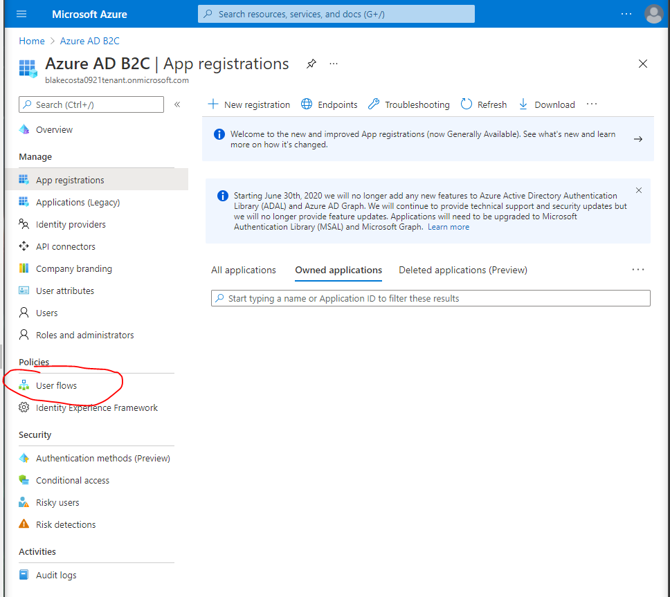
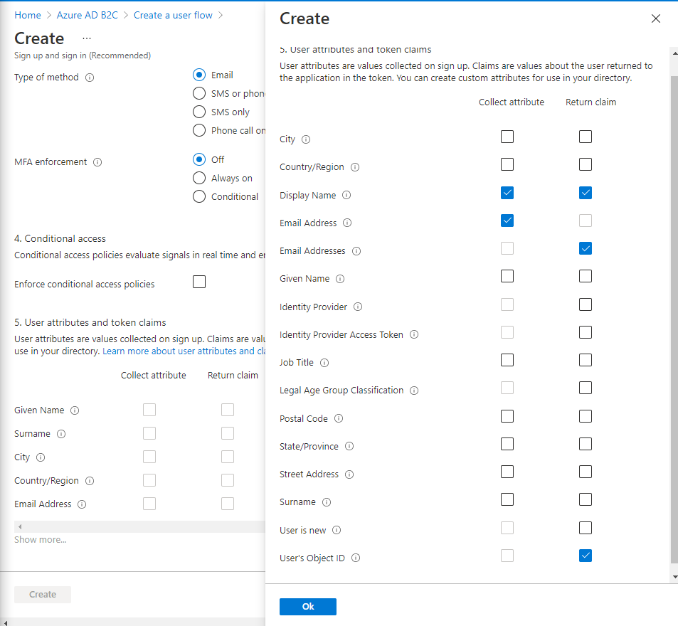

# Chapter 7: Introduction to Authentication & Authorization with Azure AD B2C
- [Chapter 7: Introduction to Authentication & Authorization with Azure AD B2C](#chapter-7-introduction-to-authentication--authorization-with-azure-ad-b2c)
  - [7.2. Walkthrough: Explore OAuth & OIDC](#72-walkthrough-explore-oauth--oidc)
    - [Clone Down The Visual OAuth App](#clone-down-the-visual-oauth-app)
    - [Register Your Own GitHub OAuth App](#register-your-own-github-oauth-app)
    - [Setup Visual OAuth](#setup-visual-oauth)
      - [Linux and MacOs](#linux-and-macos)
      - [Windows](#windows)
    - [Run Visual OAuth](#run-visual-oauth)
      - [Linux and MacOs](#linux-and-macos-1)
      - [Windows](#windows-1)
    - [WARNING: Windows Browsers](#warning-windows-browsers)
  - [Step through OAuth Application](#step-through-oauth-application)
  - [7.4. Walkthrough: Explore OAuth & OIDC](#74-walkthrough-explore-oauth--oidc)
    - [Checklist](#checklist)
  - [Setup tenant directory and link to an active azure subscription](#setup-tenant-directory-and-link-to-an-active-azure-subscription)
  - [Register Coding Events API Application](#register-coding-events-api-application)
  - [Setup SUSI Flow](#setup-susi-flow)
  - [Test user flow](#test-user-flow)
  - [7.5. Walkthrough: Set Up Access Token Authorization with Azure ADB2C](#75-walkthrough-set-up-access-token-authorization-with-azure-adb2c)
    - [Checklist](#checklist-1)
    - [The Final Coding Events API Version](#the-final-coding-events-api-version)
    - [Set Up Postman](#set-up-postman)
      - [Import the Coding Events API Collection](#import-the-coding-events-api-collection)
      - [Configure the Access Token Request Form](#configure-the-access-token-request-form)
    - [Protect the Coding Events API](#protect-the-coding-events-api)
      - [Expose a user_impersonation Scope for the API](#expose-a-user_impersonation-scope-for-the-api)
    - [Register & Configure the Postman Client Application](#register--configure-the-postman-client-application)
      - [Register the Postman Client Application](#register-the-postman-client-application)
    - [Configure authentication](#configure-authentication)
      - [Configure the Redirect URI](#configure-the-redirect-uri)
      - [Configure Implicit Flow](#configure-implicit-flow)
      - [Grant Admin Permissions for Using the Scope](#grant-admin-permissions-for-using-the-scope)
    - [Test the User Flow for Access Tokens](#test-the-user-flow-for-access-tokens)
      - [Get the Authorization URL](#get-the-authorization-url)
      - [Explore the Access Token](#explore-the-access-token)
    - [Get the Postman Access Token](#get-the-postman-access-token)
      - [If You Want To Test With Postman](#if-you-want-to-test-with-postman)
        - [Start Up Your VM And Deploy Application](#start-up-your-vm-and-deploy-application)
        - [Request API Data Via Postman](#request-api-data-via-postman)
      - [Replacing an Expired Access Token](#replacing-an-expired-access-token)

## 7.2. Walkthrough: Explore OAuth & OIDC
### Clone Down The Visual OAuth App
1. Navigate to the [Visual OAuth](https://github.com/LaunchCodeEducation/visual-oauth) repo
2. Clone down a copy of the Repo
```sh
# clone into current directory
$ git clone https://github.com/LaunchCodeEducation/visual-oauth
```
### Register Your Own GitHub OAuth App
1. Click your github profile (top right corner) and go to `settings`
2. Scroll down to `Developer settings` in the _sidebar_
3. Select `OAuth Apps`
4. Select `New OAuth App`
5. Provide the following details:
   1. `Application name`: `YOUR_NAME Visual OAuth`
   2. `Homepage URL`: `http://localhost:3000/`
   3. `Authorization callback URL`: `http://localhost:3000/`
6. Click `Register application`
7. Click on `Generate a new client secret`
> NOTE: **DO NOT** lose this client secret, this is the ONLY time you will be able to copy the information. 
8. Leave this tab open to copy over the Client ID and Secret. You will be prompted to provide these via the CLI in the next section

### Setup Visual OAuth
* Go back to your `terminal` and navigate into the `visual-oauth` application your cloned down in the [Clone Down The Visual OAuth App](#clone-down-the-visual-oauth-app) section
```sh
cd visual-oauth/
# Your path may be different depending on where you are located within your terminal
```
#### Linux and MacOs
```sh
# Run this from the root directory of the repo
$ npm run setup

# You will be prompted for [GitHub Client ID] and [GitHub Client Secret] from when you registered your GitHub oauth app
```
#### Windows
* Run this command in `PowerShell`
```sh
# Run this from the root directory of the repo
> npm run setup:windows

# You will be prompted for [GitHub Client ID] and [GitHub Client Secret] from when you registered your GitHub oauth app. Make sure you enter both EXACTLY as they appeared when we registered the application.
```
### Run Visual OAuth
* It will take several minutes for the application to build. Once done, you now need to start up the application.

> NOTE: it may take up to 30 seconds for the client application to start up

If your browser doesn't open automatically with the commands below, click this link http://localhost:3000/

> you can stop the app using `ctrl+C` in the terminal
#### Linux and MacOs
* When running Linux and or MacOs you only need to run one command which will launch both applications:
```sh
# Run this from the root directory of the repo
$ npm run start
```
#### Windows
* In Windows you will _need to start both the API and Client separately in two different PowerShell terminals_:
1. In your first PowerShell terminal:
```sh
# Run this from the root directory of the repo
> npm run start:api
```
2. In your second PowerShell terminal:

```sh
# Run this from the root directory of the repo
> npm run start:client
```
### WARNING: Windows Browsers
* This _example will not work in_**Microsoft Edge**, or **Microsoft Internet Explorer**.
* If **Edge**, or **IE** are your default browser you will need to open a browser like Firefox and manually navigate to http://localhost:3000


## Step through OAuth Application
1. After the application has loaded at http://localhost:3000, input your GitHub User Name and click `Request Public User Data`. 
2. You should see your public user data as follows: {insert screenshot}
3. Go through Step 1 and click `View Instructions`. Read through the instructions. Click `Authenticate and Authorize with Provider`
4. You should see an authorization page pop up. Click `Authorize`.
5. Read through Step 2 by clicking on `View Instructions` and click `Check for Authorization Code`. You should receive an authorization code that you can hover over to see.
6. Read through step 2.5 by clicking on `View Instructions` and click on `Send Authorization Code to Back-end`. 
7. Read through step 3 by clicking on `View Instructions` and click on `Exchange Authorization Codefor Access Token`. 
8. Complete the last step, `After OAuth Flow: Client Uses the Access Token`


## 7.4. Walkthrough: Explore OAuth & OIDC
### Checklist
Setting up our AADB2C service will involve the following steps:
1. create an AADB2C tenant directory
2. link the tenant directory to an active Azure Subscription
3. register our Coding Events API application
4. configure a Sign Up and Sign In (SUSI) flow using an Email provider.
After we have completed these steps we will register an identity using the SUSI flow and inspect the resulting JWT (identity token). We will be using the Microsoft JWT decoder tool to inspect the claims within the identity token.

## Setup tenant directory and link to an active azure subscription
1. Navigate to the [azure portal](https://portal.azure.com/#home), and click on `create a resource`
2. search for `Azure Active Directory B2C`A. click create.
3. Click `Create a new Azure AD B2C Tenant`.
4. Enter following information:
  + `Organization name`: `<yourname> ADB2C`
  + `Initial domain name`: `<yourname>0921tenant`
    + 0921 is just the month and year in the format of <MMYY>
5. In Resource group, click `Create new` to create a new resource group
6. Enter it in the format of `yourname-aadb2c-walkthrough`
7. Click `Review + create`
8. Click `Create`
  + it will take a few minutes to create the tenant and spin everything up.

## Register Coding Events API Application
1. in the search bar, search for `<yourname>0921` and select the B2C tenant that pops up.
2. Click `Azure AD B2C Settings` at the bottom
3. On left side, click `App registrations`.
4. Click on `New registration`
5. fill out form information as follows:
  + `Name`: `Coding Events API`
  + `Redirect URI`: `https://jwt.ms`
    + Keep the dropdown as `Web`
6. Click `Register`
7. On the Coding Events API dashboard that just popped up, click on `Authentication` on the left
8. Scroll down, under the `Implicit grant and hybrid flows` section, enable/check both `Access tokens` and `ID tokens` checkboxes
9. Click `Save`
10. click on `Azure AD B2C` breadcrumb link at the top.

## Setup SUSI Flow
You should be back at the Azure AD B2C dashboard, like as follows.


1. On the left side, under `Policies`, click `User flows`.
2. Click on `New user flow`
3. Click on the `Sign up and sign in` flow type.
  + leave version as `Recommended`
4. click `Create` at the bottom.
5. Enter following information for the form:
  + `Name`: `susi-flow`
  + `Identity Providers`: select `Email signup`
  + `Multifactor authentication`: leave `MFA enforcement` as `Off` and `Type of method` as `email`
6. Under `User attributes and token claims`, click `Show more...`
7. select the following and hit `Ok` when done:

8. click `Create`

## Test user flow
Now we just need to test the flow.
1. click on `B2C_1_susi-flow`
2. click `Run user flow`
3. click on `Run user flow` with the panel that just popped up on the right side.
4. a new window should open. Click on `Sign up now`
  + NOTE: if you get an internal services error, it might take upwards of 30 minutes for azure to load everything. go get some lunch and come back and try again.
5. submit a new email address and click `Send verification code`
6. check your email and input the verifcation code in the app
7. fill out a new password as `Launchcode-@zure1` and your `Display Name` as `<yourname>`
8. Click `Create`
9. A new page should load via jwt.ms and you should be able to see the identity token, you should be able to look through  `Decoded Token` and `Claims` tabs

  
## 7.5. Walkthrough: Set Up Access Token Authorization with Azure ADB2C
### Checklist
### The Final Coding Events API Version
* Use [instructions](https://education.launchcode.org/azure/chapters/intro-oauth-with-aadb2c/walkthrough_aadb2c-access.html#the-final-coding-events-api-version) in the book
### Set Up Postman
* Use [instructions](https://education.launchcode.org/azure/chapters/intro-oauth-with-aadb2c/walkthrough_aadb2c-access.html#set-up-postman) in the book
#### Import the Coding Events API Collection
* Use [instructions](https://education.launchcode.org/azure/chapters/intro-oauth-with-aadb2c/walkthrough_aadb2c-access.html#import-the-coding-events-api-collection) in the book
#### Configure the Access Token Request Form
NOTE: Once inside the authorization tab scroll down to the `Configure New Token` section. In here you will be able to edit the fields listed. 
### Protect the Coding Events API

#### Expose a user_impersonation Scope for the API
To access the `Expose an API` setting, search for the tenant you created. Then open up the `Open B2C Tenant`like below {insert tenant screenshot here}. You might have to log in again, a new page should load then click on `App registrations` {insert screenshot here}. Then select your app {insert screenshot here}. You should now see `Expose an API` on the left-hand side.

1. Press add scope and then click `Save and continue`.
2. Then fill out the form and put in the following values:
* Scope name: user_impersonation
* Admin consent display: User impersonation access to API
* Admin consent description: Allows the Client application to access the API on behalf of the authenticated user


3. click `Add scope`
4. click the blue copy button to copy the URL 
5. Go back to postman, replace the `Scope` field with your copied value.
### Register & Configure the Postman Client Application
#### Register the Postman Client Application
1. click on `Azure AD B2C` breadcrumb
2. click `App registrations`
3. click on  `New registration`
4. Fill out the form with the following information:
   * Name: Postman
   * Redirect URI: https://jwt.ms
5. Click `Register` after that
6. Copy the `Application (client) id` to the clipboard
7. In postman paste that into the `Client ID` field
### Configure authentication
#### Configure the Redirect URI
1. Uncheck the `Authorize using browser` and replace the `Callback URL` with:
   * `https://www.postman.com/oauth2/callback`
#### Configure Implicit Flow
1. In azure click on `Authentication` under the `Manage` section
2. click/enable `Access tokens` and `ID tokens`
3. click `save`
4. click on `Add URI` under the `Redirect URI's` section and add the following:
    * `https://www.postman.com/oauth2/callback`
5. click `save` again
6. In postman, just double check that `Grant Type` is selected as `Implicit`
#### Grant Admin Permissions for Using the Scope
1. In azure, click on `API permissions` on the left hand sidebar
2. Click on `Add a permission`
3. Click on `My APIs` tab on the right {insert screenshot here}.
4. Click on `Coding Events API` 
5. Enable the `user_impersonation` scope 
6. click `Add permissions` {insert screenshot}
7. click on the check mark `Grant admin consent for <Name> ADB2C`
    * Select `Yes` for the confirmation popup
### Test the User Flow for Access Tokens
1. click the `Azure AD B2C` breadcrumb
2. under the `Policies` section on the left side, click `User flows`
3. Select the SUSI flow we configured in the previous walkthrough
#### Get the Authorization URL
1. Click `Run user flow`, this will open up a sidebar
2. . Click the `metadata document` link
   * This is the link directly under the `Run user flow` title at the top
   * A new page should open
3. Copy the `authorization_endpoint` url.
   * Copy *just* the url, not the quotations
4. Switch back to postman and replace `Auth URL` with the `authorization_endpoint` you just copied
#### Explore the Access Token
1. click on `Reply URL` and select `https://jwt.ms`
   * you should still be on the `Run user flow` page 
2. Click on `Access Tokens` section
3. select the `Resource` as `Coding Events API`
4. click on `Scopes`, only `user_impersonation` should be selected 
   * make sure the others are deselected and matches this image: {insert screenshot here}
5. Click `Run user flow`
   * a separate window should open
   * login with whatever username you created
   * If that username or pw doesn't work, click on `signup`
   * jwt.ms should load and you should see your access token
     * For more info, see section [7.5.6.2 Explore The Access Token](https://education.launchcode.org/azure/chapters/intro-oauth-with-aadb2c/walkthrough_aadb2c-access.html#explore-the-access-token)
### Get the Postman Access Token
1. Switch back to postman
2. Put in any random character string into `State`
3. Click on `Get New Access Token`
   * a new window will popup
   * sign in with your username and pw you created
   * once signed in you should see a popup that says `Authentication Complete`
4. In the `Manage Access Tokens` window that pops up, click on `Use Token`
   * you should back at the authorization window, and should see your access token

#### If You Want To Test With Postman
As of right now, if you were to select the `Public Access` directory you would see that it has a request called `Retrieve all Coding Events`
* Open the `Retrieve all Coding Events` request
* Inside you will see that it uses a variable called `{{baseUrl}}`
  * We need to configure this
  * Before we configure this we need to start up our VM again
##### Start Up Your VM And Deploy Application
1. Go to Azure
2. Navigate to your VM
3. Start your VM
4. Copy the `public ip address`
5. Go to your terminal and provide the following command:
   * `ssh student@<Your VMs Public IP Address>`
   * Login with the correct password: `LaunchCode-@zure1`
6. Run the `deploy_project_script.sh` file to deploy your project

##### Request API Data Via Postman
1. Navigate back to Postman
2. Click the three does to the left of `Coding events API` on the left sidebar
3. Select `Edit`
4. Select the `Variables` tab
5. Update the `baseUrl` values (INITIAL and CURRENT) with your VMs public IP address
6. Click back on the `Retrieve all Coding Events` request and click the `Send` button
   * It should return an empty array: `[]`
     * This is due to the fact that we have not added any data to the database

#### Replacing an Expired Access Token
If you need a new access token after 1 hour. Do the following steps
1. open the collection settings (three dots next to the collection name)
2. switch to the Authorization tab and select Get New Access Token
3. select Request Token to re-authorize and receive a new one
4. select Use Token (and discard any expired ones)
5. select Update to save the changes to the collection